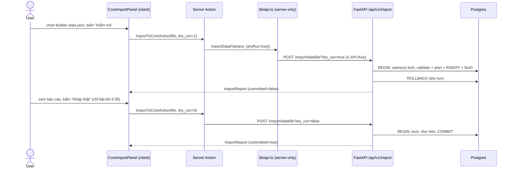

# Spec: Nhập dữ liệu JSON vào Postgres qua core API

- Trạng thái: DRAFT (chờ User chốt các quyết định D1-D14 ở mục 7)
- Tác giả: architect
- Ngày: 2026-10-07
- Nhánh lúc viết: `feat/data-tab-cleanup`
- Alembic head lúc viết spec: `d4e9f2a6b8c5` (add notes.archived_at). Epic này **không thêm migration** (xem mục 2).
- Đã đối chiếu với code thật và với chính `data/builder-data.json`, `data/ai-logs.json` (chỉ đọc). Những điểm giả định ban đầu lệch với code nằm ở **Phụ lục A**.

## 1. Bối cảnh & phạm vi

**Vấn đề.** Dữ liệu thật của User nằm ở `data/builder-data.json` (chế độ `DATA_SOURCE=file`). Muốn chuyển sang `DATA_SOURCE=api` (Postgres) thì phải đưa dữ liệu đó vào Postgres, nhưng hiện không có đường nào làm được đúng:

- `actions-import.ts` (khôi phục JSON, upload Excel Jira) chặn cứng ở chế độ api.
- `importDataAction` → `transfer.importJson` **có** nhánh api (POST từng bản ghi), nhưng với file thật nó hỏng ngay ở project đầu tiên và kể cả khi chạy được thì làm mất dữ liệu, nhân đôi khi chạy lại, và vướng rate limit. Chi tiết ở Phụ lục A, mục 2.

**Mục tiêu.** Một endpoint nhập hàng loạt ở core API: nhận nguyên file JSON export của web, kiểm tra kỹ, có chế độ dry-run trả báo cáo, ghi trong **một transaction**, **idempotent** (chạy lại không nhân đôi), **không bao giờ xoá** dữ liệu đang có.



**In-scope**
- Backend: schema Pydantic cho file nhập, service nhập (chuẩn hoá, ánh xạ id, chống trùng, dry-run, transaction, khoá tuần tự), hai endpoint `POST /api/v1/import/datafile` và `POST /api/v1/import/ai-logs`, test pytest (unit + DB + API + một test tuỳ chọn chạy trên file thật ở chế độ chỉ đọc).
- Thực thể: `projects`, `tasks`, `task_events` (từ `tasks[].events`), `notes`, `ai_logs` (từ file riêng `data/ai-logs.json`).
- Web ở chế độ `DATA_SOURCE=api`: panel "Chuyển dữ liệu JSON vào Postgres" trên trang `/data` có bước Kiểm tra → Nhập thật; ẩn/thay bằng thông báo những thành phần chỉ chạy ở chế độ file.

**Out-of-scope**
- Chế độ `replace` / xoá dữ liệu Postgres theo file. Không có, kể cả ẩn.
- Những thứ sống trong file nhưng không phải thực thể (xem D10): `meta.current_users`, `meta.minutes_logged_today/date`, `sync_urls`, cấu hình/đồng bộ Jira, Vault (`data/vault.json`, độc lập với `DATA_SOURCE`), lịch sử Chrome (`data/chrome-history.json`). Endpoint chỉ **báo** là đã bỏ qua.
- Nhập CSV ở chế độ api (giữ nguyên đường cũ trong `transfer.ts`, hạn chế đã biết: rate limit 120 req/phút).
- Đường ngược Postgres → file. Export ở chế độ api (`transfer.collect`) vẫn bỏ `events` như hiện tại.
- Sửa lỗi `engine.snapshot()` không ghi `sync_urls` (Phụ lục A, mục 4) và việc Jira sync / Excel import chưa chạy ở chế độ api.
- `scripts/smoke-test.sh` (cần Docker). Thay bằng pytest; bổ sung smoke ở lần sau.

## 2. Thay đổi dữ liệu

| Bảng | Thay đổi | Index/Constraint | Ghi chú migration (downgrade?) |
|---|---|---|---|
| (không) | Không thêm bảng/cột | Dùng sẵn: PK `id` UUID; `projects.key` unique; partial unique `uq_tasks_source_external_id`, `uq_notes_source_external_id` (`WHERE deleted_at IS NULL`); các CHECK hiện có | **Không có migration.** `alembic heads` phải vẫn là `d4e9f2a6b8c5`. |

**Rollback dữ liệu (thay cho downgrade).** Ở chế độ mặc định `on_conflict=skip`, lần nhập chỉ INSERT, không UPDATE/DELETE gì. Hai lớp rollback:
1. Bắt buộc trước lần nhập thật đầu tiên: `pg_dump` database (hoặc `make backup` nếu có). Khôi phục bằng dump.
2. Mỗi task được tạo có một `task_events` đánh dấu (D8) mang `import_id`; báo cáo trả `import_id`. Tài liệu kèm câu SQL xoá theo `import_id` cho task. Project/note được tạo đều có id trùng id trong file, nên có thể xoá theo danh sách id trong file nếu Postgres trước đó rỗng.

### 2.1. Ánh xạ thực thể (trả lời câu hỏi 1)

Ký hiệu: **G** giữ nguyên, **C** chuẩn hoá (có cảnh báo), **B** bỏ (báo trong `ignored_fields`), **S** server tự đặt.

**Project** (`DataFile.projects[]` → `projects`)

| Field JSON | Cột Postgres | Xử lý |
|---|---|---|
| `id` (UUID, `crypto.randomUUID()`) | `id` | G (D2) |
| `key` | `key` varchar(20) unique, regex `^[A-Z][A-Z0-9_]{1,19}$` | C: bỏ dấu tiếng Việt (NFKD, `Đ/đ`→`D`), in hoa, ký tự ngoài `A-Z0-9` → `_`, gộp `_` liên tiếp, cắt `_` hai đầu, cắt 20 ký tự, nếu không bắt đầu bằng chữ thì thêm tiền tố `P_`, nếu < 2 ký tự thì lỗi. Ví dụ thật: `ONE NEXUS`→`ONE_NEXUS`, `SAO MỘC`→`SAO_MOC`, `KHÁC`→`KHAC`. Hai project trong file ra cùng key → **lỗi** (D7). |
| `name` (≤200), `description` | `name`, `description` | G |
| `color` | `color` varchar(7), hex | C: hex hợp lệ → hạ chữ thường; `hsl(h, s%, l%)` → đổi sang `#rrggbb` (`colorsys.hls_to_rgb`); dạng khác → `null` + cảnh báo. File thật: 14/14 project là `hsl(...)`. |
| `is_archived`, `created_at`, `updated_at` | cùng tên | G |

**Task** (`DataFile.tasks[]` → `tasks`)

| Field JSON | Cột | Xử lý |
|---|---|---|
| `id` | `id` | G |
| `title` (≤500), `description`, `assignee` (≤200), `status`, `priority` | cùng tên | G, validate như `TaskBase` (strip, enum) |
| `project_id` | `project_id` | Ánh xạ qua bảng `project_id_map` (id trong file → id trong DB, xem 2.2). Không có trong map mà `project.key` có → khớp theo key đã chuẩn hoá. Vẫn không thấy → `null` + cảnh báo `project_unlinked`. |
| `project` (object nhúng) | — | B (dẫn xuất) |
| `due_at`, `completed_at` | timestamptz | G. Datetime không có múi giờ → coi là UTC + cảnh báo `naive_datetime`. |
| `scheduled_for` | `date` | G |
| `estimate_minutes` | CHECK `> 0`, schema `≤ 43200` | G; giá trị vi phạm → `null` + cảnh báo |
| `spent_minutes` | CHECK `>= 0` | G (TaskCreate hiện không có field này, schema nhập có) |
| `tags` | `varchar(64)[]` | `normalize_tags()` dùng chung; > 20 tag → lỗi (giữ đúng luật hiện có) |
| `source`, `external_id` (≤255), `external_url` | cùng tên | G |
| `created_at`, `updated_at` | cùng tên | G (ghi tường minh, không để `server_default`) |
| `deleted_at` khác null | — | Bỏ qua cả task, đếm `skipped_trash` (D5) |
| `events[]` | `task_events` | Xem dưới |
| `is_overdue`, `days_until_purge` (nếu file xuất từ chế độ api) | — | B (field tính toán) |
| `raw_payload` | `raw_payload` | **Không nhận** từ file, luôn `NULL` (D11). File thật không có field này. |
| `status=done` mà `completed_at=null` | `completed_at` | Đặt bằng `updated_at` + cảnh báo `completed_at_backfilled` |

**TaskEvent** (`tasks[].events[]` → `task_events`): `id` G, `task_id` = id task đích (sau ánh xạ), `event_type` enum `TaskEventType` (sai → lỗi), `actor` ≤100 (mặc định `"user"`), `payload` dict hoặc null (qua `_jsonable`, JSON-serialize ≤ 16 KB, vượt → lỗi), `created_at` G. Event của task bị bỏ qua thì bỏ theo.

**Note** (`DataFile.notes[]` → `notes`): `id`, `title` (≤300), `kind`, `content` (≤20000), `description`, `context` (≤200), `tags`, `is_pinned`, `is_dangerous`, `use_count` (≥0), `last_used_at`, `source` (`NoteSource`), `external_id`, `archived_at` (thiếu → null), `created_at`, `updated_at`: G. `project_id`: ánh xạ như task. `deleted_at` khác null → `skipped_trash`. `days_until_purge`, `project`: B. `raw_payload`: không nhận.

**AiLog** (`data/ai-logs.json` → `ai_logs`, endpoint riêng)

| Field JSON | Cột | Xử lý |
|---|---|---|
| `id` | `id` | G |
| `category` (file thật: `TOOL`, `WEB`, `APP`, `API`, `UI/UX`, `DOCS`) | enum `app/api/web/tool/other` | C: hạ chữ thường; `UI/UX` → `web`; giá trị khác → `other` + cảnh báo (D9) |
| `prompt`, `response` | `Text` | G, phải khác rỗng |
| `handling` (file thật **không có**) | `Text` NOT NULL, `AiLogRead` đòi `min_length=1` | C: thiếu/rỗng → chuỗi cố định `"(không ghi nhận)"`. Không được để `""`, nếu không `GET /ai-logs` sẽ vỡ khi validate response. |
| `created_at` | `created_at` | G |
| `updated_at` (file thật không có) | `updated_at` | = `created_at` |

**Mất dữ liệu có chủ đích (cần User chấp nhận, D10):** `meta.*`, `sync_urls`, object `project` nhúng, field tính toán, task/note đang ở thùng rác của file. Không có field nghiệp vụ nào của task/note/project bị mất. Với file thật: `description` của task đều là chuỗi giữ chỗ `"[Nội dung Jira dạng khối (Atlassian Document Format)]"` hoặc null, nên không có gì thêm để mất.

### 2.2. Id, quan hệ và khoá idempotent (trả lời câu hỏi 2, 3)

Id trong file đều là UUID v4 (`engine.ts` dùng `crypto.randomUUID()`; file thật xác nhận). Quyết định đề xuất: **giữ nguyên id** (D2). Lợi ích: chạy lại khớp được theo id, giữ được quan hệ `project_id`/`task_id` mà không cần đoán, link cũ dạng `/tasks/<id>` vẫn đúng.

Thứ tự khớp một bản ghi trong file với bản ghi đã có trong DB (D3):

| Thực thể | Khoá 1 | Khoá 2 (khi khoá 1 không thấy) | Ghi chú |
|---|---|---|---|
| Project | `id` | `key` đã chuẩn hoá | Khớp theo key với id khác → ghi vào `project_id_map[file_id] = db_id`, báo `matched_by=key`. Khớp theo id mà key khác → giữ key trong DB, cảnh báo. |
| Task | `id` (kể cả bản trong thùng rác DB) | `(source, external_id)` với `external_id` khác null và `deleted_at IS NULL` | Trùng `(source, external_id)` giữa **hai task còn sống trong cùng file** → lỗi ở task thứ hai (sẽ vi phạm partial unique index). |
| TaskEvent | `id` | — | Chỉ chèn khi task đích được tạo mới (hoặc được cập nhật ở chế độ `update_if_newer`). |
| Note | `id` | `(source, external_id)` như task | Không dùng dấu vân tay `title+content` như `transfer.ts` (không cần vì đã giữ id). |
| AiLog | `id` | — | |

Hệ quả: chạy lại cùng file lần hai → `created = 0` ở mọi thực thể, `skipped_existing = số bản ghi`. Đây là tiêu chí nghiệm thu.

### 2.3. Xung đột, transaction, giới hạn (trả lời câu hỏi 4, 6)

**Xung đột (D4).** Tham số `on_conflict`:
- `skip` (mặc định): bản ghi đã có thì giữ nguyên DB, đếm `skipped_existing`.
- `update_if_newer` (tuỳ chọn, cần User chốt có làm hay không): chỉ ghi đè khi `updated_at` trong file **mới hơn** DB; ghi `updated_at` tường minh bằng giá trị trong file (để `onupdate=func.now()` không đè); với task thì chèn thêm event còn thiếu theo id, không xoá event nào. Không bao giờ đổi `projects.key`, không bao giờ "hồi sinh" bản ghi đang ở thùng rác DB (đếm `skipped_trash_in_db`).
- Không có chế độ nào xoá bản ghi DB không có trong file.

**Lỗi so với cảnh báo.** Cảnh báo (`warning`) = đã tự chuẩn hoá theo đúng các luật liệt kê ở 2.1, vẫn ghi được. Lỗi (`error`) = mọi thứ còn lại (enum sai, title rỗng, quá độ dài, > 20 tag, key trùng sau chuẩn hoá, trùng `(source, external_id)` trong file, event_type sai, payload quá lớn...).

**Transaction (D6): all-or-nothing.** Một request = một transaction. Có bất kỳ lỗi nào → không ghi gì, trả báo cáo với `committed=false`. Không có chế độ "nhập phần hợp lệ". Lý do: nhập dở một nửa rồi chạy lại khó suy luận; dry-run đã cho thấy lỗi trước.

**Dry-run (câu hỏi 5).** `dry_run` mặc định **`true`** (phải gửi `dry_run=false` tường minh mới ghi). Dry-run chạy **đúng cùng đường code** với lần ghi thật: validate, lập kế hoạch, INSERT, `flush` (để bắt luôn CHECK/unique của Postgres), rồi `ROLLBACK`. Như vậy báo cáo dry-run khớp với kết quả thật.

**Khoá tuần tự.** Đầu transaction gọi `SELECT pg_try_advisory_xact_lock(hashtext('builder:import'))`; không lấy được → 409 "Đang có một lần nhập khác chạy". Khoá tự nhả khi commit/rollback.

**Batch.** Đọc trước các id/khoá đã có bằng `SELECT ... WHERE id = ANY(:ids)` theo lô 1000; INSERT bằng `insert(Model)` với danh sách dict theo lô 500 dòng (task ~22 cột × 500 < giới hạn 32767 tham số của asyncpg). Thứ tự: projects → tasks → task_events → notes.

**Giới hạn (D12).**

| Giới hạn | Giá trị đề xuất | Vượt thì |
|---|---|---|
| Kích thước body (backend, theo `Content-Length`) | 10 MB | 413 |
| Kích thước file (web, như `MAX_UPLOAD_BYTES` hiện có) | 8 MB | lỗi ở Server Action, không gọi core |
| `projects` / `tasks` / `notes` mỗi request | 1 000 / 20 000 / 10 000 | 422 (validate envelope) |
| Tổng `events` trong file | 200 000 | 422 |
| `ai_logs` mỗi request | 20 000 | 422 |
| `schema_version` | 1..4 (`SUPPORTED_DATAFILE_VERSION = 4`, khớp `SCHEMA_VERSION` web) | 422 |
| Số mục `issues` trả về | 500, kèm `issues_truncated=true` | cắt bớt, đếm vẫn đúng |

File thật hiện ~550 KB, 14 project, 498 task: nằm xa dưới mọi ngưỡng; một request là đủ, không bị rate limit (120 req/phút).

## 3. API contract

Prefix `/api/v1/import`, router mới gắn vào `api_router` nên **tự có** `require_api_key`. Tên module `app/api/v1/imports.py` (`import` là từ khoá Python).

| Method | Path | Request | Response | Lỗi |
|---|---|---|---|---|
| POST | `/import/datafile` | Query: `dry_run: bool = true`, `on_conflict: Literal["skip","update_if_newer"] = "skip"`. Body: `DataFileEnvelope` (JSON nguyên văn của file export web) | 200 `ImportReport` (cả khi có lỗi dòng; xem `committed`) | 401 thiếu/sai key; 409 đang có lần nhập khác; 413 body > 10 MB; 422 envelope sai (không phải object, thiếu `projects`/`tasks`, `schema_version` > 4, vượt số lượng, query sai) |
| POST | `/import/ai-logs` | Query: `dry_run: bool = true`. Body: `AiLogsEnvelope` (nội dung `data/ai-logs.json`) | 200 `ImportReport` (chỉ có `counts.ai_logs`) | như trên |

**Vì sao 200 cho lỗi dòng.** Lỗi dòng là kết quả nghiệp vụ cần hiển thị đầy đủ; `coreFetch` hiện chỉ đọc `detail` khi status không OK, nên trả 422 kèm báo cáo sẽ làm mất báo cáo. Lỗi HTTP chỉ dành cho lỗi ở mức request.

**Vì sao các mảng là `list[dict]`.** Nếu khai `tasks: list[ImportTask]`, FastAPI sẽ 422 cả request ở dòng sai đầu tiên với định dạng lỗi chung. Envelope chỉ kiểm khung; service validate từng dòng bằng `ImportTask.model_validate(row)` và gom lỗi theo `entity/index/id`.

Pydantic (file `app/schemas/imports.py`):

```python
SUPPORTED_DATAFILE_VERSION = 4

class DataFileEnvelope(BaseModel):
    model_config = ConfigDict(extra="allow")   # field lạ ở cấp file → liệt kê trong ignored_fields["file"]
    schema_version: int = Field(default=1, ge=1, le=SUPPORTED_DATAFILE_VERSION)
    exported_at: str | None = None
    projects: list[dict[str, Any]] = Field(max_length=1_000)
    tasks: list[dict[str, Any]] = Field(max_length=20_000)
    notes: list[dict[str, Any]] = Field(default_factory=list, max_length=10_000)  # v2 không có notes
    meta: dict[str, Any] | None = None   # đọc để báo cáo là đã bỏ qua, không ghi

class AiLogsEnvelope(BaseModel):
    schema_version: int = Field(default=1, ge=1, le=1)
    exported_at: str | None = None
    ai_logs: list[dict[str, Any]] = Field(max_length=20_000)

# Schema từng dòng: extra="ignore", nhưng service tự so khoá thô với model_fields
# để liệt kê field bị bỏ vào ignored_fields. KHÔNG có field raw_payload.
class ImportProject(BaseModel): id: uuid.UUID; key: str; name: str; description; color; is_archived=False; created_at; updated_at
class ImportTaskEvent(BaseModel): id: uuid.UUID; event_type: TaskEventType; actor="user"; payload: dict|None; created_at: datetime
class ImportTask(BaseModel): id; title; description; assignee; status; priority; project_id; project: dict|None;
                             due_at; scheduled_for; estimate_minutes; spent_minutes=0; completed_at; tags;
                             source=TaskSource.MANUAL; external_id; external_url; created_at; updated_at;
                             deleted_at=None; events: list[ImportTaskEvent] = []
class ImportNote(BaseModel): ... như NoteRead trừ days_until_purge/project, thêm deleted_at, archived_at=None
class ImportAiLog(BaseModel): id; category: str; prompt: str (min 1); response: str (min 1); handling: str|None; created_at; updated_at|None

class EntityCounts(BaseModel):
    received: int = 0
    created: int = 0
    updated: int = 0
    skipped_existing: int = 0
    skipped_trash: int = 0          # đang ở thùng rác trong file
    skipped_trash_in_db: int = 0    # khớp với bản ghi đang ở thùng rác DB
    invalid: int = 0

class ImportIssue(BaseModel):
    level: Literal["error", "warning"]
    entity: Literal["file", "project", "task", "task_event", "note", "ai_log"]
    index: int | None              # vị trí trong mảng của file, 0-based
    id: str | None
    code: str                      # vd invalid_enum, key_normalized, color_converted, duplicate_external_id
    message: str                   # tiếng Việt; chỉ chứa id/khoá/title cắt 80 ký tự, không chép nội dung note

class KeyChange(BaseModel):
    original: str
    normalized: str

class ImportReport(BaseModel):
    import_id: uuid.UUID
    dry_run: bool
    committed: bool                # true chỉ khi dry_run=false và 0 lỗi
    on_conflict: Literal["skip", "update_if_newer"]
    schema_version: int
    counts: dict[str, EntityCounts]          # khoá: projects, tasks, task_events, notes, ai_logs
    errors: int
    warnings: int
    issues: list[ImportIssue]
    issues_truncated: bool
    project_key_changes: list[KeyChange]
    ignored_fields: dict[str, list[str]]     # entity → tên field đã bỏ, vd {"file": ["meta"], "task": ["project","is_overdue"]}
```

Service `app/services/import_service.py`:
- Hàm thuần (unit test được, không cần DB): `normalize_project_key(raw) -> str`, `normalize_color(raw) -> tuple[str | None, bool]`, `map_ai_log_category(raw) -> AiLogCategory`.
- `async def import_datafile(session, envelope, *, dry_run, on_conflict, actor="import:datafile") -> ImportReport` và `async def import_ai_logs(session, envelope, *, dry_run) -> ImportReport`.
- Dry-run: cuối hàm `await session.rollback()`; `get_session` commit sau đó là no-op. Ghi thật mà có lỗi: cũng `rollback()` và trả `committed=false`.
- Log một dòng tổng kết (đếm, `import_id`, `dry_run`), **không** log nội dung bản ghi.
- `DomainError` mới không cần; 409 dùng `ConflictError` có sẵn.

Docstring/comment bắt buộc (theo `comment-style.md`): banner cảnh báo trong service rằng endpoint KHÔNG xoá/replace, `raw_payload` không nhận từ file, payload event và nội dung note là dữ liệu không đáng tin.

## 4. Thay đổi Web

**4.1. `lib/api.ts`**
- `importDataFile(text: string, opts: { dryRun: boolean; onConflict: "skip" | "update_if_newer" }): Promise<ImportReport>` → `coreFetch` POST `/api/v1/import/datafile?dry_run=…&on_conflict=…`, body là **nguyên văn text của file** (bỏ BOM `` ở đầu nếu có), không parse lại ở web.
- `importAiLogsFile(text: string, opts: { dryRun: boolean }): Promise<ImportReport>`.
- Ở `IS_LOCAL`: reject `new CoreApiError("Nhập vào Postgres chỉ dùng khi DATA_SOURCE=api", 501)`, không gọi engine.

**4.2. `lib/types.ts`**: alias `ImportReport`, `ImportIssue`, `EntityCounts` từ `lib/generated/openapi.d.ts`. Không viết tay field.

**4.3. Server Action** (`app/actions.ts`): `importToCoreAction(formData)` nhận `file`, `kind` (`"datafile" | "ai-logs"`), `dry_run` (`"1"`/`"0"`, mặc định `"1"`), `on_conflict`. Kiểm `file instanceof File`, `size > 0`, `size <= MAX_UPLOAD_BYTES`, giá trị enum hợp lệ; gọi 4.1; `revalidateAll()` chỉ khi `report.committed`; trả `{ ok, report?, error? }` qua `toResult`. Không import `store/engine`.

**4.4. `lib/store/transfer.ts`** (chặn đường hỏng): ở chế độ api, `importJson` và `importAiLogsJson` ném lỗi rõ ràng "Dùng mục 'Chuyển dữ liệu JSON vào Postgres'" thay vì POST từng bản ghi. Không đổi nhánh file/memory, không đổi CSV.

**4.5. Component mới `components/core-import-panel.tsx`** (client)
- Chọn loại (`builder-data.json` / `ai-logs.json`), chọn file, chọn cách xử lý trùng (`Bỏ qua bản đã có` mặc định; `Cập nhật nếu file mới hơn` chỉ hiện nếu User chốt D4 có làm).
- Nút **Kiểm tra** (dry-run) → bảng đếm theo thực thể (nhận / sẽ tạo / sẽ cập nhật / đã có / thùng rác / lỗi), danh sách đổi key project, tối đa 50 issue đầu (lỗi trước cảnh báo), dòng "Đã bỏ qua: meta.current_users, …".
- Nút **Nhập thật** chỉ bật khi lần Kiểm tra gần nhất là **cùng file** (so `name + size + lastModified`) và `errors === 0`; có `confirm()` nêu số bản ghi sẽ tạo. Đổi file hoặc đổi tuỳ chọn → phải Kiểm tra lại.
- Sau khi nhập: hiện `import_id` và nhắc "chạy lại Kiểm tra sẽ thấy 0 bản ghi mới".
- Nhắc trước khi nhập thật: "Nên chạy pg_dump trước lần nhập đầu tiên".
- Render mọi chuỗi bằng text node, không `dangerouslySetInnerHTML`.

**4.6. Component mới `components/local-only-notice.tsx`**: hộp thông báo một dòng "Chức năng này chỉ chạy khi DATA_SOURCE=file" (prop `feature: string`).

**4.7. Trang `/data` (`app/data/page.tsx`)**, khi `!IS_LOCAL`:
- Hiện `CoreImportPanel` ở đầu accordion "Nạp dữ liệu nâng cao" (hoặc thành section riêng ngay dưới card Nguồn dữ liệu, frontend-dev chọn nếu không trùng file khác).
- `DataImport` vẫn hiện nhưng chỉ còn các loại CSV: thêm prop `kinds?: readonly KindValue[]` vào `components/data-import.tsx`, trang truyền danh sách CSV ở chế độ api. Nhánh file giữ nguyên toàn bộ.
- Thay bằng `LocalOnlyNotice`: `RestoreJsonManager`, `FileUploadManager` (Excel Jira), `JiraSyncManager`, `UrlSyncManager`, `CurrentUserManager` (action của chúng hoặc chặn ở api, hoặc no-op).
- Không đụng `VaultImportManager` (độc lập `DATA_SOURCE`), `ChromeHistoryManager`, `WipeDataManager` (ghi nhận rủi ro, mục 7).
- Khi `IS_LOCAL`: trang **không đổi gì**, nhưng thêm một dòng hướng dẫn trong accordion "Hướng dẫn đổi nguồn dữ liệu": các bước chuyển sang Postgres (xem mục 6, kịch bản tay).

**Ghi chú:** `components/data-tabs.tsx` và `LocalOnlyNotice` **chưa tồn tại** trong repo (Phụ lục A, mục 1). Nếu một nhánh khác tạo `data-tabs.tsx` trước khi epic này bắt đầu, frontend-dev áp dụng cùng thay đổi vào tab "Nhập" ở đó thay cho `data/page.tsx`, và báo lại orchestrator.

## 5. Ownership (không agent nào sửa file của agent khác)

**backend-dev** (chỉ `apps/core/**`):
- `apps/core/app/schemas/imports.py` (mới)
- `apps/core/app/services/import_service.py` (mới)
- `apps/core/app/api/v1/imports.py` (mới)
- `apps/core/app/api/v1/router.py` (thêm một dòng `include_router`)
- `apps/core/tests/test_import_unit.py` (mới, không cần DB)
- `apps/core/tests/test_import_service.py` (mới, `db`)
- `apps/core/tests/test_import_api.py` (mới, `db`)
- `apps/core/tests/fixtures/datafile_sample.json`, `apps/core/tests/fixtures/ai_logs_sample.json` (mới, **dữ liệu tổng hợp**, không chép dữ liệu thật của User)
- Không sửa model, không thêm migration. Không sửa `task_service.py`/`note_service.py` (nếu cần dùng lại `_jsonable` thì import, không đổi chữ ký).

**orchestrator** (sau khi nhánh backend xong):
- Sinh lại `apps/web/lib/generated/openapi.d.ts` theo cách đã dùng ở `note-archive.md` mục 5 (`app.openapi()` không cần Postgres/Redis, rồi `npx openapi-typescript`).
- Docs: `docs/API_REFERENCE.md` (hai endpoint mới), `docs/AI_HANDOFF_STATE.md`, `docs/ai_logs.md` + `scripts/add-ai-log.js`, `apps/web/lib/docs.ts` (đăng ký spec này), hướng dẫn chuyển đổi kèm SQL rollback theo `import_id`.

**frontend-dev** (`apps/web/**` trừ `lib/generated/**`):
- `apps/web/lib/api.ts`
- `apps/web/lib/types.ts`
- `apps/web/app/actions.ts`
- `apps/web/lib/store/transfer.ts` (chỉ nhánh api của `importJson`, `importAiLogsJson`, mục 4.4)
- `apps/web/app/data/page.tsx`
- `apps/web/components/data-import.tsx` (chỉ thêm prop `kinds`)
- `apps/web/components/core-import-panel.tsx` (mới)
- `apps/web/components/local-only-notice.tsx` (mới)

**Không ai sửa:** `data/**` (dữ liệu thật), `apps/web/lib/store/engine.ts`, `json-file.ts`, `csv.ts`, `apps/web/app/actions-import.ts`, `apps/web/app/jira-actions.ts`, các `*-manager.tsx`, `scripts/smoke-test.sh`, `apps/core/app/models/**`, `apps/core/migrations/**`.

Thứ tự: backend-dev → orchestrator sinh types → frontend-dev. Có thể chạy song song trong hai worktree vì không trùng file, nhưng `tsc` của web chỉ có nghĩa sau khi `openapi.d.ts` đã sinh lại.

## 6. Tiêu chí nghiệm thu (kiểm chứng được, không cần Docker)

Biến dùng chung: `TEST_DATABASE_URL=postgresql+asyncpg://<user>:<pass>@localhost:5432/<tên>_test` (conftest từ chối DB không kết thúc bằng `_test`). Lệnh backend chạy trong `apps/core/`. Máy không có Postgres local thì mọi test `db` bị skip, **không tính là pass**.

**Backend (backend-dev dán output vào báo cáo)**
- [ ] `uv run ruff check app tests` → exit 0; `uv run ruff format --check app tests` → exit 0.
- [ ] `uv run alembic heads` → đúng một head, vẫn là `d4e9f2a6b8c5`.
- [ ] `DATABASE_URL=$TEST_DATABASE_URL API_KEY=test-api-key-0123456789 uv run alembic upgrade head && uv run alembic check` → "No new upgrade operations detected".
- [ ] `uv run pytest -q tests/test_import_unit.py` (không cần DB) → pass. Bắt buộc có: `normalize_project_key` cho `ONE NEXUS`→`ONE_NEXUS`, `SAO MỘC`→`SAO_MOC`, `KHÁC`→`KHAC`, `đường`→`DUONG`, `1ABC`→`P_1ABC`, chuỗi chỉ có ký tự đặc biệt → lỗi; `normalize_color` cho `hsl(253, 70%, 65%)` ra hex 7 ký tự hợp lệ, `#2563EB`→`#2563eb`, `red`→`None`; `map_ai_log_category` cho `TOOL`, `UI/UX`, `DOCS`.
- [ ] `TEST_DATABASE_URL=… uv run pytest -q` → toàn bộ pass, không test `db` nào bị skip. Bắt buộc có:
  - Fixture tổng hợp nhập thành công: id giữ nguyên; `task.project_id` trỏ đúng project; `created_at`, `completed_at`, `assignee`, `source`, `external_id`, `spent_minutes` giữ nguyên; task `done` thiếu `completed_at` được backfill bằng `updated_at`; event được chèn với id và `created_at` gốc; mỗi task tạo mới có một event đánh dấu nhập mang `import_id` (theo D8).
  - **Idempotent:** nhập lần hai cùng fixture → `created == 0` mọi thực thể; số dòng `tasks`, `projects`, `task_events`, `notes`, `ai_logs` không đổi.
  - **Dry-run:** sau dry-run, đếm dòng mọi bảng không đổi; báo cáo dry-run và báo cáo lần ghi thật có cùng `counts`.
  - **All-or-nothing:** fixture có một task enum sai ở cuối → `committed=false`, `errors ≥ 1`, không bảng nào có dòng mới.
  - Khớp theo khoá tự nhiên: project cùng key khác id → không tạo project mới, task trong file trỏ về project đã có; task khác id nhưng cùng `(source, external_id)` với task còn sống → `skipped_existing`.
  - Hai task còn sống trong file cùng `(jira, X-1)` → lỗi `duplicate_external_id`.
  - Task/note có `deleted_at` trong file → `skipped_trash`, không có trong DB.
  - Field `raw_payload` trong file bị bỏ: cột `raw_payload` của task tạo ra là `NULL`, `ignored_fields["task"]` chứa `raw_payload`.
  - `ai_logs`: `handling` thiếu → `"(không ghi nhận)"`; sau đó `GET /api/v1/ai-logs` trả 200 (không vỡ validate response).
  - Nếu làm `update_if_newer` (D4): file mới hơn → `updated`, giá trị `updated_at` bằng giá trị trong file; file cũ hơn → `skipped_existing`; bản ghi ở thùng rác DB → `skipped_trash_in_db`, `deleted_at` không đổi.
  - API: thiếu `X-API-Key` → 401; `schema_version: 99` → 422; body không phải object → 422; `Content-Length` > 10 MB → 413; mặc định không truyền `dry_run` → `committed=false` và DB không đổi; hai request đồng thời → một trong hai 409 (test bằng cách giữ khoá advisory ở session khác).
- [ ] **Thử trên file thật, chỉ đọc** (test tuỳ chọn, skip khi thiếu biến):
  ```bash
  IMPORT_REAL_DATAFILE=/Users/hungdv-mac/Downloads/ai_assistant_personal/data/builder-data.json \
  IMPORT_REAL_AILOGS=/Users/hungdv-mac/Downloads/ai_assistant_personal/data/ai-logs.json \
  TEST_DATABASE_URL=… uv run pytest -q -s -k real_file
  ```
  Test mở file bằng chế độ `"rb"`, tính sha256 và `mtime` trước và sau, **assert không đổi**. Không ghi bất cứ thứ gì cạnh file. Kỳ vọng (theo số liệu đo ngày 2026-10-07, file có thể đã thay đổi lúc chạy):
  - Dry-run: `errors == 0`; `projects.received == 14`, `tasks.received == 498`, `notes.received == 0`, `task_events.received == 0`; `project_key_changes` có 3 mục (`ONE NEXUS`, `SAO MỘC`, `KHÁC`); 14 cảnh báo `color_converted`; `ignored_fields["file"]` chứa `meta`.
  - Ghi thật vào DB `_test`: `projects.created == 14`, `tasks.created == 498`.
  - Chạy lại: `created == 0`, `tasks.skipped_existing == 498`.
  - ai-logs: `ai_logs.received == 61`, `errors == 0`, có cảnh báo cho `UI/UX` (→ web) và `DOCS` (→ other).
  - Nếu dry-run báo `duplicate_external_id` hoặc lỗi khác trên file thật: **dừng, báo User**, không sửa file.

**Sinh types (orchestrator)**
- [ ] `openapi.d.ts` có path `/api/v1/import/datafile`, `/api/v1/import/ai-logs` và schema `ImportReport`; `git diff --stat` chỉ chứa phần liên quan.

**Web (frontend-dev)**
- [ ] `cd apps/web && npx tsc --noEmit` → exit 0.
- [ ] `git diff --name-only <base>...HEAD -- apps/web/lib/generated apps/web/lib/store/engine.ts apps/web/lib/store/json-file.ts apps/web/app/actions-import.ts` → rỗng.
- [ ] `grep -n "store/engine" apps/web/components/core-import-panel.tsx apps/web/components/local-only-notice.tsx` → rỗng.
- [ ] `grep -n "dangerouslySetInnerHTML" apps/web/components/core-import-panel.tsx` → rỗng.
- [ ] `grep -n "CORE_API_KEY\|X-API-Key" apps/web/components/` → rỗng (key không xuống browser).

**Ownership**
- [ ] `git diff --name-only` của từng nhánh agent chỉ nằm trong danh sách mục 5; `git status data/` sạch.

**Kịch bản tay (UAT, khi có môi trường chạy core thật)**
1. Ở chế độ file, tải `/api/export?format=json` (hoặc dùng bản sao của `data/builder-data.json`; không sửa bản gốc). Tải thêm `?entity=ai_logs`.
2. `pg_dump` database thật.
3. `make use-db` → mở `/data`: card nguồn hiện Postgres; các manager chỉ-file hiện `LocalOnlyNotice`; ô "Thay toàn bộ" vẫn bị khoá.
4. Panel "Chuyển dữ liệu JSON vào Postgres": chọn file → Kiểm tra → thấy 14 project / 498 task sẽ tạo, 3 key đổi; nút Nhập thật bật. Bấm Nhập thật → `committed`.
5. `/tasks` có đủ task, lọc theo project (kể cả `SAO_MOC`) đúng; `/stats` "hoàn thành 7 ngày" phản ánh ngày đóng thật, không dồn hết vào hôm nay.
6. Kiểm tra lại cùng file → 0 bản ghi mới. Đổi sang file khác mà chưa Kiểm tra → nút Nhập thật bị khoá.
7. Không có Docker: tương đương bằng `curl -X POST -H "X-API-Key: $API_KEY" -H "Content-Type: application/json" --data-binary @/Users/hungdv-mac/Downloads/ai_assistant_personal/data/builder-data.json "http://localhost:8000/api/v1/import/datafile?dry_run=true"` (curl chỉ đọc file).

**Review**
- [ ] `code-reviewer` duyệt toàn bộ diff; `security-auditor` duyệt (endpoint ghi hàng loạt, Server Action mới); `db-reviewer` xác nhận không cần migration và cách INSERT theo lô/advisory lock.

## 7. Rủi ro & quyết định cần User chốt

| # | Câu hỏi | Đề xuất | Lý do |
|---|---|---|---|
| D1 | Sửa đường POST từng bản ghi ở web, hay làm endpoint nhập hàng loạt ở core? | Endpoint hàng loạt ở core | Một transaction, một request (không vướng rate limit 120/phút), giữ được field mà `TaskCreate` không cho đặt (`created_at`, `completed_at`, `spent_minutes`, events), validate bằng Pydantic ở một chỗ. |
| D2 | Giữ id UUID trong file hay sinh mới? | Giữ | Id đã là UUID v4; giữ thì idempotent theo id và không phải dựng lại quan hệ. Rủi ro trùng id ngẫu nhiên giữa hai bản ghi khác nhau: không đáng kể. |
| D3 | Khoá chống trùng | `id`, sau đó khoá tự nhiên (`projects.key` đã chuẩn hoá; `(source, external_id)` còn sống cho task/note) | Bắt được trường hợp bản ghi đã có trong Postgres từ đường khác với id khác. |
| D4 | Bản ghi đã có: bỏ qua, ghi đè hay báo lỗi? | Mặc định `skip`. **Có làm `update_if_newer` không?** Đề xuất: có, nhưng chỉ bật khi chọn tường minh | Kịch bản thật: nhập xong vẫn dùng chế độ file vài ngày (Jira sync cập nhật task), rồi nhập lại. Với `skip`, thay đổi đó bị bỏ. Không làm thì giảm phạm vi và giảm rủi ro ghi đè từ file giả. |
| D5 | Task/note đang ở thùng rác của file | Bỏ qua, đếm `skipped_trash` | Giống luật merge hiện có trong `transfer.ts`; nhập thùng rác vào rồi bị `purge_expired` dọn ngay cũng vô nghĩa. File thật: 0 bản ghi trong thùng rác. |
| D6 | Giao dịch | All-or-nothing, `dry_run` mặc định `true` | Dễ suy luận, chạy lại an toàn; dry-run cho thấy lỗi trước. |
| D7 | Key project không hợp lệ (`ONE NEXUS`, `SAO MỘC`, `KHÁC`) và màu `hsl(...)` | Tự chuẩn hoá + cảnh báo; hai key trùng sau chuẩn hoá → lỗi | Không được sửa file thật; nới regex backend thì phá giả định ở chỗ khác. Hệ quả: key hiển thị đổi (`SAO_MOC`), `name` giữ nguyên ("Sao Mộc"). |
| D8 | Có ghi dấu "được nhập" vào `task_events`? | Có: event `synced`, actor `import:datafile`, payload `{import_id, schema_version}` | Audit trail (rule project.md) và dùng để rollback. Dùng giá trị enum sẵn có nên không cần migration. Phương án khác: thêm `TaskEventType.IMPORTED` (cần migration sửa CHECK), hoặc không ghi gì. |
| D9 | `ai_logs` có trong phạm vi? Ánh xạ category và `handling` thiếu | Có, endpoint riêng; `UI/UX`→`web`, lạ→`other`; `handling` thiếu → `"(không ghi nhận)"` | Dữ liệu nằm ở file riêng với schema khác backend; nếu không chuẩn hoá thì 61/61 log bị từ chối. |
| D10 | Thứ không phải thực thể (`meta.current_users`, `minutes_logged_today`, `sync_urls`, Jira sync, Vault, Chrome history) | Ngoài phạm vi; chỉ báo là đã bỏ qua | Postgres chưa có chỗ chứa. **Hệ quả cần User biết:** sau khi đổi sang `DATA_SOURCE=api`, danh sách "người dùng hiện tại" rỗng (`getCurrentUsersApi` trả `[]`), lọc task cá nhân/team và Jira sync/Excel import không chạy. Cần epic riêng "Settings + Jira sync ở chế độ api" trước khi bỏ hẳn chế độ file. |
| D11 | Nhận `raw_payload` từ file? | Không, luôn `NULL` | Dữ liệu không đáng tin, export của web cũng không có field này. |
| D12 | Giới hạn kích thước/số lượng | Như bảng ở 2.3 (body 10 MB, 20 000 task...) | Gấp nhiều lần dữ liệu hiện tại (550 KB, 498 task), vẫn chặn được payload bất thường. |
| D13 | Giữ timestamp gốc (`created_at`, `updated_at`, `completed_at`) hay để server đặt `now()`? | Giữ | Để server đặt thì 450+ task `done` đều "hoàn thành hôm nay", làm sai `/stats` và agenda. |
| D14 | Field lạ trong file: từ chối hay bỏ qua? | Bỏ qua + liệt kê trong `ignored_fields` | File cũ/mới hơn một chút vẫn nhập được; User vẫn thấy cái gì không được chuyển. |

Rủi ro kỹ thuật:
- **Web không có đăng nhập.** Ai mở được `/data` (kể cả qua LAN khi `make lan-up`) đều gọi được Server Action nhập. Với `skip` thì không phá được dữ liệu có sẵn, chỉ thêm được bản ghi mới; với `update_if_newer` thì có thể ghi đè bằng file có `updated_at` giả. Đây là một lý do nữa để `update_if_newer` là tuỳ chọn (D4).
- **Lệch chuẩn hoá key giữa web và backend.** Jira sync ở chế độ file tạo key bằng `toUpperCase().replace(/[^A-Z0-9]/g, '')` (bỏ dấu cách), còn file thật lại có key chứa dấu cách và dấu tiếng Việt, tức là có đường tạo project khác. Sau khi nhập, project `ONE_NEXUS` trong Postgres và một lần sync file-mode sinh ra `ONENEXUS` sẽ là hai project khác nhau. Chỉ ảnh hưởng nếu User tiếp tục dùng chế độ file sau khi nhập.
- **`WipeDataManager` ở chế độ api** thao tác trên engine trong RAM, không chạm Postgres. Không thuộc epic này, nhưng UI có thể gây hiểu nhầm; nên xử lý ở epic sau.
- **Lệch `openapi.d.ts`** khi sinh ngoài container: kiểm `git diff --stat`.
- **Không có smoke test** cho tính năng này; dựa vào pytest DB/API và test file thật tuỳ chọn.

## Phụ lục A. Giả định ban đầu lệch với code thật

1. **`components/data-tabs.tsx` và `LocalOnlyNotice` không tồn tại** (grep toàn repo, kể cả `.next`, không thấy). Trang `/data` hiện là một trang dài trong `app/data/page.tsx` với các khối `<details>`. Spec này tạo mới `local-only-notice.tsx`.
2. **Không phải mọi đường nhập đều chặn ở chế độ api.** `importDataAction` → `transfer.importJson` có nhánh api POST từng bản ghi, nhưng với file thật:
   - Project đầu tiên đã có `color: "hsl(...)"` → `ProjectCreate` 422; vòng lặp project không có `try/catch` nên cả lần nhập dừng ngay.
   - Key `ONE NEXUS`, `SAO MỘC`, `KHÁC` không qua regex `^[A-Z][A-Z0-9_]{1,19}$`.
   - Task không gửi `source`, `external_id`, `external_url`, `assignee`, `completed_at`, `created_at`, `spent_minutes`, `events`: 498 task Jira sẽ thành task `manual`, mất người được giao; `create_task` đặt `completed_at = now()` cho task `done`.
   - Task không có chống trùng → chạy lại là nhân đôi.
   - 498+ request liên tiếp vượt rate limit 120 req/phút → phần lớn bị 429.
   - Nhánh api của `importAiLogsJson` gửi `category: "TOOL"` (backend cần chữ thường) và không có `handling` (backend bắt buộc) → 61/61 bị từ chối.
3. Comment ở `lib/store/types.ts` ("nhập dữ liệu vào Postgres chỉ là POST từng bản ghi lên /api/v1/tasks, không cần viết lớp chuyển đổi") và header `transfer.ts` ("chỉ cần đổi DATA_SOURCE=api rồi nhập lại") **sai** theo mục 2. Orchestrator nên sửa hai comment này khi cập nhật docs (hoặc giao frontend-dev trong cùng nhánh, tuỳ chọn).
4. **`sync_urls` không bao giờ được ghi xuống đĩa**: `engine.snapshot()` không đưa `sync_urls` vào `DataFile`, và `restore()` cũng không đọc nó. File thật chỉ có các khoá cấp cao `schema_version, exported_at, projects, tasks, notes, meta`. Danh sách URL đồng bộ chỉ sống trong RAM. Lỗi riêng, ngoài phạm vi.
5. **`ai_logs` không nằm trong `builder-data.json`** (tách ra `data/ai-logs.json` từ schema v4), và schema của file đó (`category` in hoa, không có `handling`, không có `updated_at`) khác backend.
6. Số liệu file thật lúc viết spec: 14 project (cả 14 màu `hsl`, 3 key không hợp lệ), 498 task (tất cả `source=jira` có `external_id`, không task nào ở thùng rác, không có event, không có `scheduled_for`/`estimate_minutes`/`spent_minutes > 0`), 0 note; `meta.current_users = ["Đoàn Việt Hưng"]`. `data/ai-logs.json`: 61 log.
