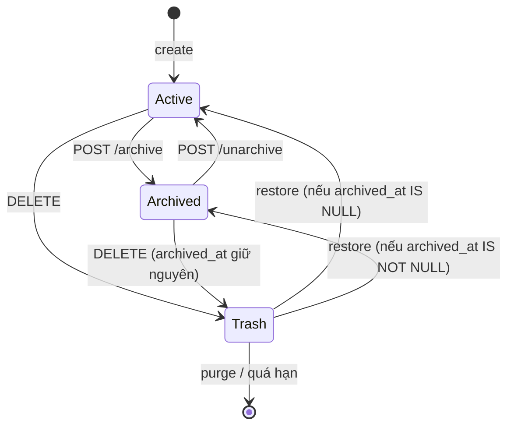

# Spec: Lưu trữ note (Note Archive)

- Trạng thái: CHỐT (User duyệt cả 10 đề xuất D1-D10 ở mục 7 trong lần chạy thử luồng multi-agent, 08-10-2026)
- Tác giả: architect
- Ngày: 2026-10-07
- Nhánh: `trial/multi-agent-note-archive`
- Alembic head lúc viết spec: `c3d8e5f1a7b4` (add tasks.assignee)
- Đối chiếu với: `docs/specs/EXAMPLE-note-archive.md` (bản mẫu). Các điểm bản mẫu sai/thiếu so với code thật nằm ở **Phụ lục A**.

## 1. Bối cảnh & phạm vi

**Vấn đề.** Sổ tay chỉ có ba trạng thái hiển thị: thường, ghim, thùng rác. Note cũ ít dùng nhưng còn giá trị tham khảo chỉ có hai lựa chọn: để nó làm đầy danh sách, hoặc xoá vào thùng rác (bị `purge_expired` xoá vĩnh viễn sau `trash_retention_days`). Cần trạng thái thứ tư: **lưu trữ** — ẩn khỏi danh sách mặc định, không bao giờ tự bị xoá, xem lại ở tab "Lưu trữ" và bỏ lưu trữ được.

**Khác thùng rác ở đâu.**

| | Thùng rác (`deleted_at`) | Lưu trữ (`archived_at`) |
|---|---|---|
| Hiện ở `/notes` mặc định | Không | Không |
| `GET /notes/{id}`, copy, sửa, ghim | 404 | Được (note vẫn "sống") |
| Bị `purge_expired` / `empty_trash` dọn | Có | **Không** |
| Chiếm chỗ unique `(source, external_id)` | Không | **Có** (note vẫn tồn tại về nghiệp vụ) |
| Nơi xem | `/trash` | `/notes?archived=1` |



**In-scope**
- Backend: cột `notes.archived_at`, migration có downgrade, lọc `archived` ở `GET /notes` và `GET /notes/stats`, hai endpoint `POST /notes/{id}/archive|unarchive`, test pytest.
- Web ở chế độ `DATA_SOURCE=api`: tab "Đang dùng" / "Lưu trữ" ở `/notes`, nút Lưu trữ / Bỏ lưu trữ trên từng note, nhãn trên `/trash` cho note đã lưu trữ, phân trang server-side 50 mục/trang cho `/notes` (xem D5).

**Out-of-scope**
- Chế độ `DATA_SOURCE=file` và `memory` (`apps/web/lib/store/**`: `engine.ts`, `json-file.ts`, `csv.ts`, `transfer.ts`). **Hạn chế đã biết:** ở hai chế độ này tab "Lưu trữ" và nút Lưu trữ bị ẩn; `api.ts` trả lỗi rõ ràng nếu bị gọi (xem 4.1). Không tăng `SCHEMA_VERSION`, không backfill JSON.
- Export/Import CSV có cột `archived_at` (`lib/store/csv.ts`, `app/actions-import.ts`): note lưu trữ khi export qua đường hiện có vẫn ra như note thường. Ghi nhận, làm ở epic sau.
- Cập nhật `scripts/smoke-test.sh` (cần Docker, nằm ngoài `apps/core/`). Thay bằng pytest API test; bổ sung smoke ở lần sau khi có Docker.
- Tự động lưu trữ theo thời gian, lưu trữ hàng loạt, lưu trữ Task.
- Sắp xếp theo `archived_at` (không thêm vào `SortField`).

## 2. Thay đổi dữ liệu

| Bảng | Thay đổi | Index/Constraint | Ghi chú migration (downgrade?) |
|---|---|---|---|
| `notes` | Thêm `archived_at timestamptz NULL` (không default) | `ix_notes_archived_at` trên `(archived_at)` `WHERE archived_at IS NOT NULL` — cùng kiểu với `ix_notes_deleted_at` đã có | `upgrade`: `add_column` nullable (chỉ đổi metadata, không rewrite bảng, không backfill) + `create_index` partial. `downgrade`: `drop_index` rồi `drop_column`; **mất thông tin lưu trữ** (note quay về danh sách thường), không mất nội dung note. Chấp nhận được. |

Chi tiết cho backend-dev:
- File mới `apps/core/migrations/versions/<rev>_add_notes_archived_at.py`, `down_revision = "c3d8e5f1a7b4"`. Không có Docker nên **không dùng `make migration`**: hoặc viết tay theo mẫu `c3d8e5f1a7b4_add_tasks_assignee.py`, hoặc `alembic revision --autogenerate` với `DATABASE_URL` trỏ vào DB `_test` đã ở head, rồi dọn lại tay.
- Model `Note`: khai báo cột trong khối "Cách dùng" hoặc khối riêng `# ── Lưu trữ ──`, comment WHY (khác thùng rác, không bị purge). Index khai trong `__table_args__` với `postgresql_where=text("archived_at IS NOT NULL")` để `alembic check` không báo drift.
- `ix_notes_pinned_recent` (`is_pinned, updated_at WHERE deleted_at IS NULL`) giữ nguyên. Danh sách mặc định thêm điều kiện `archived_at IS NULL` lọc sau index; ở quy mô cá nhân không cần index mới cho đường này. `db-reviewer` xác nhận.
- Không đổi unique partial `uq_notes_source_external_id`: note lưu trữ vẫn chiếm chỗ `(source, external_id)` — đúng ý, sync Obsidian sau này sẽ gặp note lưu trữ thay vì tạo bản trùng.
- `CREATE INDEX` thường (không `CONCURRENTLY`) vì bảng nhỏ; ghi chú này vào comment migration.

## 3. API contract

Prefix `/api/v1/notes`, cần header `X-API-Key` như mọi route v1.

| Method | Path | Request | Response | Lỗi |
|---|---|---|---|---|
| GET | `/notes` | Query hiện có + **`archived: bool = False`** | `Page[NoteRead]` | 422 sai kiểu (`archived=abc`) |
| GET | `/notes/stats` | **`archived: bool = False`** | `dict[str, int]` (kind → count) — **shape không đổi** | 422 sai kiểu |
| POST | `/notes/{note_id}/archive` | không body | 200 `NoteRead`, `archived_at` khác null | 404 không có hoặc đang ở thùng rác; 422 `note_id` không phải UUID |
| POST | `/notes/{note_id}/unarchive` | không body | 200 `NoteRead`, `archived_at = null` | 404 như trên; 422 như trên |

Ngữ nghĩa:
- `archived=false` (mặc định): chỉ note `deleted_at IS NULL AND archived_at IS NULL`. `archived=true`: chỉ note `deleted_at IS NULL AND archived_at IS NOT NULL`. Không có giá trị "cả hai" (tránh thêm tham số; không ai cần).
- `/notes/stats?archived=…` đếm theo kind **trong đúng view đó**. Hiện `count_by_kind` đếm cả note lưu trữ; sau epic, mặc định chỉ đếm note đang dùng. Không thêm khoá `"archived"` vào dict (lý do ở Phụ lục A, mục 4).
- **Idempotent** (D2): archive note đã lưu trữ → 200, **giữ nguyên `archived_at` cũ**; unarchive note chưa lưu trữ → 200, không đổi gì.
- `archived_at` do server đặt bằng `services.clock.now_utc()`. **Không** thêm vào `NoteCreate`/`NoteUpdate`; PATCH không đổi được trạng thái lưu trữ (một đường duy nhất).
- Note lưu trữ vẫn: `GET /{id}` 200, `PATCH` được, `POST /{id}/use` được, `DELETE` được (vào thùng rác, `archived_at` giữ nguyên), `restore` đưa về đúng trạng thái lưu trữ (D7).
- `updated_at` tự tăng khi archive/unarchive do `TimestampMixin.onupdate` — chấp nhận, không viết code né (D9).
- Hai route mới có `{note_id}` nên đặt trong khối "Từng note", sau `/restore`; không xung đột route tĩnh.

Pydantic:
```python
# schemas/note.py — NoteRead
archived_at: datetime | None = Field(
    default=None, description="Khác null nghĩa là đã lưu trữ: ẩn khỏi danh sách mặc định, không bị dọn"
)
```
Service (`note_service.py`):
- `NoteFilters.archived: bool = False`; `_apply_filters` thêm điều kiện theo cờ này.
- **KHÔNG** thêm điều kiện lưu trữ vào `_alive()`. `_alive()` dùng cho `get_note`; nếu thêm, note lưu trữ thành 404 và không unarchive/copy/sửa được.
- `count_by_kind(session, *, archived: bool = False)`.
- `archive_note(session, note_id) -> Note`, `unarchive_note(session, note_id) -> Note`: dùng `get_note` (404 cho note đã xoá), idempotent, `flush` + `refresh`, docstring nêu WHY.
- `delete_note`, `restore_note`, `purge_*`, `empty_trash`: không sửa.

## 4. Thay đổi Web

### 4.1. `lib/api.ts`
- `ListNotesOptions` thêm `archived?: boolean`. Đường API: `if (options.archived) params.set("archived", "true")`. Đường local: nếu `options.archived` trả trang rỗng `{ items: [], total: 0, limit, offset }`, ngược lại gọi engine như cũ.
- `getNoteStats(options?: { archived?: boolean })`: thêm `?archived=true` khi cần. Local: `archived` → `{}`.
- Hàm mới `archiveNote(id)`, `unarchiveNote(id)` → `POST /api/v1/notes/{id}/archive|unarchive`, trả `Note`. Local: reject bằng `new CoreApiError("Lưu trữ note chỉ hỗ trợ khi DATA_SOURCE=api", 501)` — không gọi `engine` (engine chưa có hàm này).
- Không đổi chữ ký các hàm khác.

### 4.2. Server Action (`app/actions.ts`)
- `archiveNoteAction(id)`, `unarchiveNoteAction(id)` theo mẫu `deleteNoteAction`: gọi `api.ts`, `revalidateAll()`, trả `ActionResult`, lỗi qua `toResult`.

### 4.3. Route `/notes` (`app/notes/page.tsx`)
- Search params mới: `archived=1` (cùng kiểu với `pinned=1` hiện có), `page` (số nguyên ≥ 1).
- Tab "Đang dùng (N)" / "Lưu trữ (M)" bằng `<Link>`, giữ `q`, `kind`, `sort`, `pinned`, reset `page`. N, M = tổng của `getNoteStats({archived:false})` / `getNoteStats({archived:true})` (gọi song song trong `Promise.all` cùng `listNotes`).
- Ô "Loại" trong bộ lọc hiện số đếm của **view đang xem**.
- Phân trang (D5): bỏ `limit: 200`, dùng `limit: 50, offset: (page-1)*50`; thanh phân trang có Trước/Sau, "Trang x / y", "Tổng: n kết quả", giữ mọi filter trong URL. Theo mẫu đã có ở `app/tasks/page.tsx` (helper link nội bộ trong file page, không tạo component dùng chung để không chạm file tasks).
- Gợi ý tìm kiếm (D6): ở tab "Đang dùng", khi có `q`, gọi thêm `listNotes({ ...cùng filter, archived: true, limit: 1 })`; nếu `total > 0` hiện dòng "Có M mục khớp trong Lưu trữ" kèm link sang tab Lưu trữ với cùng filter.
- Ẩn toàn bộ tab Lưu trữ, gợi ý D6 và nút lưu trữ khi `IS_LOCAL` (import từ `lib/api`), truyền xuống component bằng prop.
- Câu giới thiệu cuối trang thêm một dòng phân biệt Lưu trữ với Thùng rác.

### 4.4. Component
- `components/note-filters.tsx`: `NoteFilterState` thêm `archived: boolean`; form GET thêm `<input type="hidden" name="archived" value="1">` khi đang ở tab Lưu trữ (nếu không, bấm "Lọc" sẽ nhảy về tab Đang dùng); link "Bỏ lọc" trỏ `/notes?archived=1` khi đang ở tab Lưu trữ. `archived` không tính vào `isFiltered`.
- `components/note-item.tsx`: prop mới `archiveSupported: boolean`. Nút "Lưu trữ" khi `note.archived_at == null`, "Bỏ lưu trữ" khi khác null, dùng `run(...)` có sẵn. Khi đã lưu trữ, hiện "Lưu trữ lúc {formatDateTime(...)}" ở dòng meta. So sánh bằng `== null` / `?? null` vì type sinh ra là optional (xem 4.5).
- `components/trash-note-item.tsx`: nếu `note.archived_at != null` hiện nhãn "Đã lưu trữ — phục hồi sẽ về tab Lưu trữ".
- Nội dung note vẫn render bằng text node, không đổi.

### 4.5. Types
- `lib/generated/openapi.d.ts` sẽ có `archived_at?: string | null` (optional vì `default=None`).
- **Không** ép required trong `lib/types.ts` (không mở rộng `WithRequiredDeletedAt`). Lý do: `StoredNote = Omit<Note, "days_until_purge">` ở `lib/store/types.ts`; ép required làm `engine.ts`, `csv.ts`, `transfer.ts` lỗi `tsc` vì object literal thiếu field — tức là buộc phải sửa `lib/store/**` đang out-of-scope. Component xử lý `undefined` như `null`. Khi epic sau làm file mode thì ép required luôn ở đó.
- `lib/types.ts` dự kiến không phải sửa. Nếu `tsc` báo lỗi cần sửa, frontend-dev được sửa nhưng phải ghi lý do trong báo cáo.

## 5. Ownership (không agent nào sửa file của agent khác)

**backend-dev** (chỉ `apps/core/**`):
- `apps/core/app/models/note.py`
- `apps/core/app/schemas/note.py`
- `apps/core/app/services/note_service.py`
- `apps/core/app/api/v1/notes.py`
- `apps/core/migrations/versions/<rev>_add_notes_archived_at.py` (mới)
- `apps/core/tests/test_note_service.py` (thêm test)
- `apps/core/tests/test_note_api.py` (mới)

**orchestrator** (bước nối giữa hai agent, sau khi nhánh backend xong):
- Sinh lại `apps/web/lib/generated/openapi.d.ts` (frontend-dev **không** sửa file này, backend-dev cũng không). Máy không có Docker nên không dùng `make gen-types`; dùng:
  ```bash
  cd /Users/hungdv-mac/Downloads/ai_assistant_personal/apps/core && \
    DATABASE_URL=postgresql+asyncpg://x:x@localhost:5432/x API_KEY=dummy-api-key-0123456789 \
    uv run python -c "import json,sys; from app.main import app; json.dump(app.openapi(), sys.stdout)" \
    > "$SCRATCH/openapi.json"
  cd /Users/hungdv-mac/Downloads/ai_assistant_personal/apps/web && \
    npx openapi-typescript "$SCRATCH/openapi.json" -o lib/generated/openapi.d.ts
  ```
  (`app.openapi()` không chạy lifespan nên không cần Postgres/Redis thật; `$SCRATCH` là thư mục tạm của session.)
- Docs: `docs/API_REFERENCE.md`, `docs/AI_HANDOFF_STATE.md`, `docs/ai_logs.md` + `scripts/add-ai-log.js`, `apps/web/lib/docs.ts` (đăng ký spec này).

**frontend-dev** (`apps/web/**` trừ `lib/generated/**` và `lib/store/**`):
- `apps/web/lib/api.ts`
- `apps/web/app/actions.ts`
- `apps/web/app/notes/page.tsx`
- `apps/web/components/note-item.tsx`
- `apps/web/components/note-filters.tsx`
- `apps/web/components/trash-note-item.tsx`
- `apps/web/lib/types.ts` chỉ khi bắt buộc (4.5)

Thứ tự: backend-dev → orchestrator sinh types → frontend-dev. Có thể chạy backend-dev và frontend-dev song song trong hai worktree vì không trùng file, nhưng `tsc` của frontend chỉ có nghĩa sau khi orchestrator sinh lại `openapi.d.ts` trên nhánh đã merge backend.

Không ai sửa: `apps/web/lib/store/**`, `scripts/smoke-test.sh`, `apps/web/app/actions-import.ts`, `apps/web/app/tasks/**`.

## 6. Tiêu chí nghiệm thu (kiểm chứng được, không cần Docker)

Biến dùng chung: `TEST_DATABASE_URL=postgresql+asyncpg://<user>:<pass>@localhost:5432/<tên>_test` (conftest từ chối DB không kết thúc bằng `_test`). Lệnh backend chạy trong `apps/core/`.

**Backend (backend-dev tự chạy, dán output vào báo cáo)**
- [ ] `uv run ruff check app migrations tests` → exit 0.
- [ ] `uv run alembic heads` → đúng **một** head, là revision mới; file migration có `down_revision = "c3d8e5f1a7b4"`.
- [ ] Vòng migration trên DB test:
  ```bash
  export DATABASE_URL=$TEST_DATABASE_URL API_KEY=test-api-key-0123456789
  uv run alembic upgrade head && uv run alembic downgrade -1 && uv run alembic upgrade head && uv run alembic check
  ```
  → cả bốn lệnh exit 0; `alembic check` in "No new upgrade operations detected" (model và migration khớp, kể cả partial index).
- [ ] `TEST_DATABASE_URL=… uv run pytest -q` → toàn bộ pass, **không test `db` nào bị skip** (nếu thấy skip nghĩa là biến chưa đặt, không tính là pass). Test bắt buộc có:
  - service: archive làm note biến khỏi `list_notes` mặc định và có mặt khi `archived=True`; unarchive đưa về; archive hai lần giữ nguyên `archived_at` lần đầu; archive note đã xoá → `NotFoundError`; xoá note lưu trữ rồi `restore_note` → `archived_at` còn nguyên và note nằm ở view lưu trữ; `count_by_kind` mặc định không đếm note lưu trữ, `archived=True` thì đếm; `get_note` và `mark_used` vẫn chạy với note lưu trữ; `purge_expired` không đụng note lưu trữ có `deleted_at IS NULL`.
  - API (`client` fixture): `POST /api/v1/notes/{id}/archive` 200 và `archived_at` khác null; `GET /api/v1/notes` không chứa id đó, `GET /api/v1/notes?archived=true` có; `GET /api/v1/notes?archived=abc` 422; `POST /api/v1/notes/{uuid ngẫu nhiên}/archive` 404; `GET /api/v1/notes/stats?archived=true` trả dict kind → số; `POST …/unarchive` 200, `archived_at` null.

**Sinh types (orchestrator)**
- [ ] `grep -c "archived_at" apps/web/lib/generated/openapi.d.ts` ≥ 1, và có path `/api/v1/notes/{note_id}/archive`, `/unarchive`.
- [ ] `git diff --stat apps/web/lib/generated/openapi.d.ts` chỉ chứa thay đổi liên quan lưu trữ (nếu diff lớn bất thường do khác phiên bản openapi-typescript/FastAPI so với lần sinh trong container, dừng lại báo User).

**Web (frontend-dev)**
- [ ] `cd apps/web && npx tsc --noEmit` → exit 0.
- [ ] `git diff --name-only <base>...HEAD -- apps/web/lib/store apps/web/lib/generated` trên nhánh frontend → rỗng.
- [ ] `grep -rn "store/engine" apps/web/app/notes apps/web/components/note-*.tsx apps/web/components/trash-note-item.tsx` → rỗng (không gọi engine trực tiếp).
- [ ] `grep -n "dangerouslySetInnerHTML" apps/web/components/note-item.tsx apps/web/components/trash-note-item.tsx` → rỗng.

**Ownership**
- [ ] `git diff --name-only` của từng nhánh agent chỉ nằm trong danh sách mục 5.

**Kịch bản tay (UAT, làm khi có môi trường chạy API thật — không chặn nghiệm thu lần thử này)**
- Lưu trữ một note ở `/notes` → biến mất khỏi tab Đang dùng, số trên hai tab đổi đúng; sang tab Lưu trữ thấy note kèm "Lưu trữ lúc …"; Bỏ lưu trữ → quay lại.
- Ở tab Lưu trữ chọn Loại rồi bấm Lọc → vẫn ở tab Lưu trữ. Bấm "Bỏ lọc" → vẫn ở tab Lưu trữ.
- Tìm `q` khớp một note lưu trữ ở tab Đang dùng → hiện gợi ý "Có 1 mục khớp trong Lưu trữ".
- Xoá note lưu trữ → `/trash` có nhãn "Đã lưu trữ"; phục hồi → note về tab Lưu trữ.
- Với > 50 note: thanh phân trang hiện, sang trang 2 giữ nguyên filter và tab.

**Review**
- [ ] `db-reviewer` duyệt migration + model; `code-reviewer` duyệt toàn bộ diff; không còn mục chặn.

## 7. Rủi ro & quyết định cần User chốt

Các quyết định đã chọn sẵn (đề xuất), User duyệt hoặc đổi:

| # | Câu hỏi | Đề xuất | Lý do |
|---|---|---|---|
| D1 | Lưu bằng `archived_at timestamptz` hay `is_archived bool` như `Project`? | `archived_at` | Biết lúc nào lưu trữ (hiển thị, sau này tự lưu trữ theo tuổi); cùng kiểu với `deleted_at`. Chấp nhận lệch với `Project.is_archived` (Project đổi qua PATCH, không có endpoint riêng). |
| D2 | Archive lần hai: 409 (bản mẫu) hay idempotent? | Idempotent 200, giữ `archived_at` cũ | Bấm đúp / hai tab không nên ra lỗi đỏ. Codebase cũng không dùng 409 cho sai trạng thái (`restore_note` dùng 422). |
| D3 | Note đang ghim mà lưu trữ có tự bỏ ghim? | Không, giữ cờ ghim | Bỏ lưu trữ thì về đúng chỗ cũ. Tab Lưu trữ vẫn xếp note ghim trước (do `_apply_sort`) — chấp nhận. |
| D4 | Đếm note lưu trữ ở `/notes/stats` thế nào? | Thêm query `archived`, giữ shape dict kind → số | Thêm khoá `"archived"` như bản mẫu làm sai `totalAll` ở `page.tsx`. |
| D5 | Thêm phân trang 50/trang cho `/notes` trong epic này? | Có | `/notes` hiện tải `limit: 200`, không có `?page=` — vi phạm rule 3.5; đằng nào cũng sửa page này. Nếu User muốn giữ epic nhỏ: tách ra epic riêng, tab Lưu trữ tạm dùng `limit: 200` như hiện tại. |
| D6 | Tìm kiếm ở tab Đang dùng có báo kết quả khớp trong Lưu trữ? | Có, một dòng gợi ý + link (thêm 1 request `limit=1` chỉ khi có `q`) | Rủi ro UX lớn nhất của tính năng: "tìm không ra lệnh cũ vì đã lưu trữ". |
| D7 | Phục hồi từ thùng rác một note từng lưu trữ thì về đâu? | Về tab Lưu trữ (giữ `archived_at`) | Đúng trạng thái trước khi xoá; nhãn trên `/trash` báo trước. |
| D8 | Chế độ `DATA_SOURCE=file/memory`? | Ẩn tab và nút; `api.ts` trả lỗi 501 nếu bị gọi | Theo phạm vi lần thử. Hạn chế đã biết, cần epic tiếp theo cho `lib/store/**` + `SCHEMA_VERSION` v5. |
| D9 | Archive/unarchive có làm tăng `updated_at`? | Có (hành vi sẵn của `TimestampMixin`, giống `mark_used`/`delete`) | Không viết code né. Hệ quả: sort "Sửa gần nhất" ở tab Lưu trữ ≈ "vừa lưu trữ"; note vừa bỏ lưu trữ nổi lên đầu tab Đang dùng. |
| D10 | Note lưu trữ có thuộc phạm vi tìm kiếm ngữ nghĩa/RAG sau này (`TARGET_ARCHITECTURE.md` 1.2)? | Có | Lưu trữ là ẩn khỏi danh sách hằng ngày, không phải bỏ đi tri thức. Chỉ ghi nhận, không làm gì ở epic này. |

Rủi ro kỹ thuật:
- **Lệch `openapi.d.ts`** khi sinh ngoài container (khác phiên bản `openapi-typescript`/Python). Giảm thiểu: kiểm `git diff --stat` như mục 6.
- **Quên `_alive()`**: nếu backend-dev nhét điều kiện lưu trữ vào `_alive()` thì unarchive vỡ — đã có test `get_note` với note lưu trữ để bắt.
- **Form GET mất tab**: đã có hidden input + kịch bản tay.
- **File mode lệch hành vi** với API mode cho tới khi làm epic tiếp theo; export CSV không mang trạng thái lưu trữ.
- **Không có smoke test** cho tính năng ở lần này; phụ thuộc pytest API test. Bổ sung `scripts/smoke-test.sh` khi có Docker.

## Phụ lục A. Bản mẫu `EXAMPLE-note-archive.md` sai/thiếu gì so với code thật

1. **"giữ server-side `?page=`, 50 note/trang như hiện tại" — sai.** `app/notes/page.tsx` gọi `listNotes({ limit: 200 })`, không đọc `page`, không có thanh phân trang. → D5.
2. **"nút trong menu của mỗi note" — không có menu.** `components/note-item.tsx` dùng hàng nút inline (Copy / Ghim / Xoá).
3. **`archived: bool | None` mặc định `false`** mâu thuẫn với chính câu "không làm trạng thái bỏ trống". Phải là `bool = False`.
4. **Đề xuất thêm khoá `archived` vào `/notes/stats` làm hỏng web**: `page.tsx` tính `totalAll = Object.values(counts).reduce(...)`, khoá mới bị cộng vào tổng. Đồng thời bản mẫu không nói `count_by_kind` hiện đang đếm cả note lưu trữ → số trong ô "Loại" sai sau khi lưu trữ. → D4.
5. **409 cho thao tác lặp** không khớp quy ước (sai trạng thái ở `restore_note`/`purge_note` là `ValidationError` 422) và khó chịu khi bấm đúp. → D2.
6. **Thiếu cảnh báo về `_alive()`**: điều kiện lưu trữ chỉ được đặt trong `_apply_filters`/`count_by_kind`; đặt vào `_alive()` sẽ làm `get_note`, `mark_used`, `update_note`, `unarchive` trả 404.
7. **Thiếu xử lý form GET**: `NoteFilters` là `<form method="get">` không có field `archived`, và "Bỏ lọc" là `href="/notes"` → mỗi lần lọc ở tab Lưu trữ sẽ bị đá về tab Đang dùng.
8. **Thiếu nhánh `IS_LOCAL` trong `api.ts`**: mọi hàm export đều có đường local gọi `engine`; bản mẫu không nói hàm mới làm gì ở file mode (engine chưa có `archiveNote`, gọi sẽ lỗi `tsc`). Còn `listNotes` ở file mode sẽ âm thầm bỏ qua `archived` và tab Lưu trữ hiện toàn bộ note. → 4.1, D8.
9. **Ép `archived_at` required trong `types.ts` (ngầm định) sẽ vỡ `tsc`** ở `lib/store/**` vì `StoredNote = Omit<Note, ...>`. Bản mẫu không nhắc. → 4.5.
10. **Không có test pytest**: repo đã có `apps/core/tests/` (commit `c634cf0`, `5b38bb8`) với fixture `session`/`client` và hàng rào `_test`; bản mẫu chỉ dựa vào `make smoke`.
11. **Mọi lệnh nghiệm thu đều cần Docker** (`make lint`, `make migrate`, `make downgrade`, `make smoke`, `make gen-types`) — không chạy được trên máy này. Bản mẫu cũng không dùng `alembic check` để bắt lệch giữa model và migration.
12. **Ownership chưa sạch**: giao `scripts/smoke-test.sh` (ngoài `apps/core/`) cho backend-dev; giao `lib/store/*` cho frontend-dev dù không cần; `lib/types.ts` "chỉ phần helper nếu cần" mơ hồ; không ai được giao chạy sinh `openapi.d.ts`.
13. **Không nêu `down_revision`** (`c3d8e5f1a7b4`) và cách tạo migration khi không dùng được `make migration`.
14. **Thiếu các tương tác**: `/trash` (phục hồi về đâu, cần nhãn), tìm kiếm (note lưu trữ biến khỏi kết quả — rủi ro UX chính), unique `(source, external_id)` (note lưu trữ vẫn chiếm chỗ), `updated_at` bị `onupdate` đẩy lên, `purge_expired` (cần test chứng minh không đụng note lưu trữ).
15. Bản mẫu đúng ở: dùng `archived_at` + partial index, không đụng `deleted_at`, route mới có `{note_id}` nên không xung đột route tĩnh, xoá note lưu trữ giữ `archived_at`, giữ cờ ghim.
