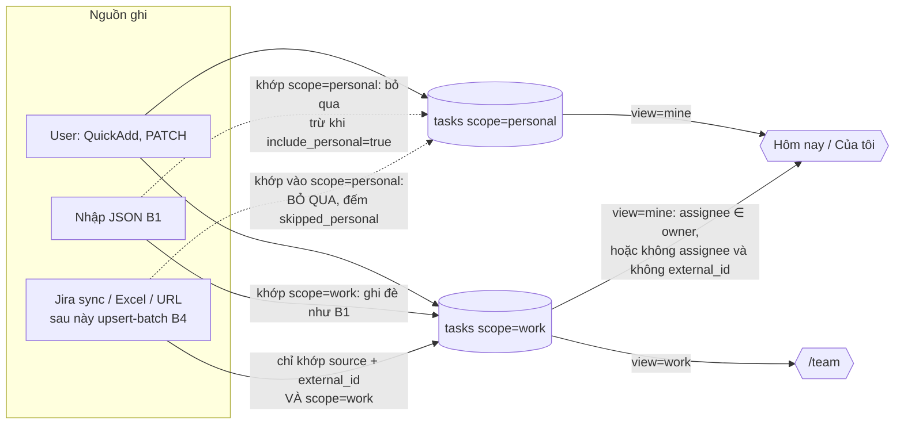

# Spec: Tách task công việc (Jira) và task cá nhân bằng cột `tasks.scope`

- Trạng thái: DRAFT (chờ User chốt các quyết định S1-S15 ở mục 7)
- Tác giả: architect
- Ngày: 2026-10-08
- Nhánh lúc viết: `feat/import-b1` (pha B1 đã code, chưa merge vào `main`)
- Alembic head lúc viết spec: `e5f1a3b7c9d2` (add import_runs/import_audit, thuộc B1)
- **Phụ thuộc:** chỉ merge sau PR B1. Migration của epic này có `down_revision = "e5f1a3b7c9d2"` và sửa `import_service.py` do B1 tạo ra.
- Hướng đã chọn (User): **B**. Thêm cột tường minh `tasks.scope` (`work` | `personal`) vào **cùng** bảng `tasks`, không tách bảng. Mặc định suy từ `source` (`jira` → `work`, `manual` → `personal`), sửa được.
- Đã đối chiếu với code thật và với `data/builder-data.json` (chỉ đọc). Các điểm lệch giữa đề bài và code nằm ở **Phụ lục A**.

## 1. Bối cảnh & phạm vi

### 1.1. Vấn đề

User có hai loại task. **Task công việc** đến từ Jira, dùng để theo dõi việc ở công ty, gồm cả việc của người khác trong team. **Task cá nhân** do User tự tạo để quản lý việc riêng. Hiện hệ thống không có khái niệm nào phân biệt hai loại này:

- **Web ở chế độ file** dùng một quy tắc ngầm, chép tay ở 5 chỗ trong `lib/store/engine.ts` (`getAgenda`, `getStats`, `listTasks`, và hai nhánh của `wipeAllData`):
  `isMyTask = assignee ? currentUsers.includes(assignee) : source !== 'jira'`.
  Quy tắc này trộn hai câu hỏi khác nhau: "task này thuộc loại gì" và "task này giao cho ai".
- **Backend (Postgres)** không lọc gì. `task_service.get_agenda` và `get_stats` gom mọi task còn sống. `GET /tasks` có `source` và `assignee` nhưng không có khái niệm "việc của tôi". Ở chế độ api, `lib/api.ts::listTasks` còn bỏ qua cả `assignee` lẫn `forCurrentUser` (Phụ lục A, mục 2).
- **Không có rào chắn ghi.** Jira sync ở web khớp task theo `external_id` mà không xét `source` hay loại task. Nhập Excel/URL khớp theo **tiêu đề** khi dòng không có Issue Key. Nhập JSON (B1) ghi đè theo `id` hoặc `(source, external_id)`. Cả ba đều có thể ghi đè một task User coi là của riêng mình.

Dữ liệu thật hôm nay (`data/builder-data.json`, `schema_version: 4`, chỉ đọc): 738 task, cả 738 đều `source=jira` và có `external_id`, không task nào trong thùng rác, không task `manual`. Trong đó 73 task giao cho `Đoàn Việt Hưng` (= `meta.current_users`), 663 task giao người khác, 2 task không có assignee.

### 1.2. Mô hình sau epic

`scope` trả lời **một** câu hỏi: task này là việc công ty (được tích hợp quản lý) hay việc riêng. "Việc của tôi" là một **view** tính từ `scope` và `assignee`, không lưu thành cột.

| | `scope = work` | `scope = personal` |
|---|---|---|
| Tạo ra bởi | Jira sync, nhập Excel/URL, sau này `upsert-batch` (B4); hoặc User tự chọn | User tạo tay (mặc định); hoặc User chuyển từ `work` |
| Bị đồng bộ ghi đè | Có, nếu có `external_id` và `source` là nguồn tích hợp | **Không bao giờ** |
| Hiện ở "Hôm nay" | Chỉ khi giao cho User (hoặc không có assignee và không đến từ tích hợp) | Luôn hiện (theo đúng điều kiện ngày của agenda) |
| Hiện ở `/team` | Có | Không |



### 1.3. In-scope

- **Backend:** enum `TaskScope`; cột `tasks.scope` kèm CHECK, migration có backfill và downgrade; `scope` trong `TaskCreate`/`TaskUpdate`/`TaskRead`; tham số `view` + `owner` cho `GET /tasks`, `GET /tasks/agenda`, `GET /tasks/stats`; nhập JSON (B1) đọc `scope`, backfill cho file cũ, bảo vệ task cá nhân (`include_personal`), `SUPPORTED_DATAFILE_VERSION = 5`; pytest.
- **Web (cả ba chế độ `DATA_SOURCE`):** `SCHEMA_VERSION` 4 → 5 kèm migrate backfill; engine dùng `scope` thay cho quy tắc ngầm; helper thuần `lib/task-scope.ts` dùng chung engine và component; tab ở `/tasks`; `/team` lọc `scope=work`; badge và nút đổi scope ở `TaskItem`; chọn scope ở `QuickAddForm`; rào chắn ở Jira sync, nhập Excel/URL, khôi phục JSON chế độ file; danh mục xoá ở Vùng nguy hiểm định nghĩa lại theo scope; ở chế độ api, Vùng nguy hiểm hiện `LocalOnlyNotice` thay cho nút xoá hiện đang không làm gì.

### 1.4. Out-of-scope

- Tách bảng, hay thêm khái niệm người dùng/chủ sở hữu (multi-user). `scope` **không** phải ranh giới bảo mật (mục 6).
- Lưu `current_users` ở Postgres. Việc này thuộc B2. Epic này chỉ thêm tham số `owner` để web truyền danh sách tên (mục 3.2, S6).
- Đưa `/team` sang phân trang server-side. Cần endpoint đếm theo assignee và lọc theo ngày hoạt động, nên tách thành epic riêng (S12). Lỗi hiện có của `/team` ở chế độ api (`limit=10000` → 422) vẫn còn (Phụ lục A, mục 3).
- Chặn ở backend việc sửa các trường do Jira sở hữu. Epic này chỉ cảnh báo ở UI (S7).
- Xoá hàng loạt theo scope ở chế độ api (endpoint wipe).
- Index mới cho `scope` (mục 2.3).
- `scripts/smoke-test.sh` (cần Docker). Dùng pytest thay thế. Bổ sung smoke ở lần có Docker.
- Sửa hành vi có sẵn của Jira sync chế độ file với task trong thùng rác, và việc nó không cập nhật `assignee` của task đã có (Phụ lục A, mục 5). Chỉ ghi nhận.

## 2. Thay đổi dữ liệu

### 2.1. Bảng

| Bảng | Thay đổi | Index/Constraint | Ghi chú migration (downgrade?) |
|---|---|---|---|
| `tasks` | Thêm `scope VARCHAR(32) NOT NULL DEFAULT 'personal'` | `ck_tasks_scope_valid`: `scope IN ('work', 'personal')`. **Không** thêm index (2.3). Không đổi `uq_tasks_source_external_id`. | Upgrade: add column (chỉ đổi metadata, không viết lại bảng), backfill bằng một `UPDATE`, rồi tạo CHECK. Downgrade: drop CHECK, drop column. Mất các lựa chọn scope User đã sửa tay; dữ liệu khác không đổi. |

### 2.2. Mã nguồn cho backend-dev

**Enum** (`app/models/enums.py`):

```python
class TaskScope(StrEnum):
    """Task là việc công ty hay việc riêng.

    CẠM BẪY: có CHECK ở DB (`ck_tasks_scope_valid`), và `alembic check` KHÔNG so
    sánh CHECK. Thêm giá trị mà quên migration DROP/ADD CONSTRAINT thì INSERT bị từ chối.
    """
    WORK = "work"
    PERSONAL = "personal"


# Nguồn tích hợp mà task mặc định là việc công ty (S2).
WORK_SOURCES = frozenset({TaskSource.JIRA, TaskSource.GITHUB, TaskSource.GITLAB})


def default_scope_for(source: TaskSource) -> TaskScope:
    """Nguồn duy nhất của quy tắc suy scope từ source (migration, service, nhập file).
    Web có bản sao ở apps/web/lib/task-scope.ts, hai bản phải khớp."""
```

**Model** (`app/models/task.py`), khai trong khối "Nguồn gốc", comment giải thích WHY (khác `source`, sửa được, quyết định rào chắn đồng bộ):

```python
scope: Mapped[TaskScope] = mapped_column(
    enum_column(TaskScope, "task_scope"),
    server_default=TaskScope.PERSONAL.value,
)
# __table_args__ thêm:
CheckConstraint("scope IN ('work', 'personal')", name="scope_valid"),
```

- **Không** khai `default=` phía Python. Service phải tự quyết `scope` từ `source` trước khi tạo. Nếu quên, DB rơi về `'personal'` an toàn hơn `'work'`: task không bị đồng bộ ghi đè. Test bắt trường hợp này (mục 5.1).
- `server_default` ở model phải trùng **chính xác** với migration, vì `migrations/env.py` bật `compare_server_default=True`.
- Có thể dùng helper `_in_list("scope", TaskScope)` như `models/import_audit.py` nếu helper đó dùng chung được. Nếu không, viết chuỗi tay như trên.

**Migration** `apps/core/migrations/versions/<rev>_add_tasks_scope.py`, `down_revision = "e5f1a3b7c9d2"`. Không có Docker nên viết tay theo mẫu `e5f1a3b7c9d2_add_import_audit.py` / `c3d8e5f1a7b4_add_tasks_assignee.py`:

```python
def upgrade() -> None:
    # NOT NULL + DEFAULT hằng số: Postgres 11+ chỉ ghi metadata, không viết lại bảng.
    op.add_column(
        "tasks",
        sa.Column(
            "scope",
            sa.Enum("work", "personal", name="task_scope", native_enum=False, length=32),
            server_default="personal",
            nullable=False,
        ),
    )
    # Backfill theo default_scope_for(). Cố ý KHÔNG đụng updated_at: đây là phân
    # loại lại dữ liệu cũ, không phải User sửa task. Đổi updated_at sẽ làm lần nhập
    # B1 sau báo nhầm "file cũ hơn DB" (file_older_than_db) cho mọi task Jira.
    op.execute("UPDATE tasks SET scope = 'work' WHERE source IN ('jira', 'github', 'gitlab')")
    # CHECK tường minh: sa.Enum(native_enum=False) không tự tạo CHECK.
    op.create_check_constraint(
        op.f("ck_tasks_scope_valid"), "tasks", "scope IN ('work', 'personal')"
    )


def downgrade() -> None:
    # Mất các lựa chọn scope User đã sửa tay (task Jira chuyển thành cá nhân và ngược lại).
    op.drop_constraint(op.f("ck_tasks_scope_valid"), "tasks", type_="check")
    op.drop_column("tasks", "scope")
```

- Không ghi `task_events` cho backfill: đây là migration, không phải sự kiện nghiệp vụ.
- Trước khi downgrade trên dữ liệu thật, có thể giữ lại các lựa chọn sửa tay (orchestrator ghi lệnh này vào docs):
  ```sql
  COPY (SELECT id, scope FROM tasks
        WHERE scope <> CASE WHEN source IN ('jira','github','gitlab') THEN 'work' ELSE 'personal' END)
  TO STDOUT WITH CSV HEADER;
  ```
- `conftest.py` không cần sửa: `TRUNCATE` đã gồm `tasks`.

### 2.3. Index

Không thêm index. Agenda và stats chạy trên khoảng 1 000 task còn sống. `scope` chỉ có hai giá trị nên index riêng vô ích. Partial index `ix_tasks_open_agenda` vẫn phủ điều kiện ngày, còn điều kiện `scope`/`assignee` được lọc sau. `db-reviewer` xác nhận. Nếu sau này vượt khoảng 50 000 task thì xét `(scope, assignee) WHERE deleted_at IS NULL`.

### 2.4. Không có ràng buộc giữa `source` và `scope` (S3)

Cả bốn tổ hợp đều hợp lệ:

| | `work` | `personal` |
|---|---|---|
| `source=jira` | Mặc định. Bị đồng bộ cập nhật. | User "tách khỏi đồng bộ": giữ link Jira, sync bỏ qua. |
| `source=manual` | Việc công ty không có trên Jira. Sync không bao giờ chạm vì không có `(jira, external_id)`. | Mặc định. |

Partial unique `uq_tasks_source_external_id` **giữ nguyên**. Task Jira đã chuyển thành `personal` vẫn chiếm khoá `(jira, KEY-1)`. Vì thế sync không tạo được bản trùng, mà báo `skipped_personal`. Đây là hành vi đúng ý: User đã chủ động nhận task đó về làm việc riêng. Muốn đồng bộ lại thì chuyển về `work`.

## 3. API contract

Prefix `/api/v1`, cần `X-API-Key` như mọi route v1. Route tĩnh `/agenda`, `/stats` vẫn khai **trước** `/{task_id}`.

### 3.1. Bảng endpoint

| Method | Path | Request | Response | Lỗi |
|---|---|---|---|---|
| GET | `/tasks` | Query hiện có + **`view: TaskView = all`**, **`owner: list[str]`** (lặp lại) | `Page[TaskRead]` (`TaskRead` có thêm `scope`) | 422: `view` sai; `owner` đi kèm `view` khác `mine`; quá 20 tên; tên rỗng sau strip hoặc dài hơn 200 ký tự |
| GET | `/tasks/agenda` | `reference_date` + **`view`**, **`owner`** | `AgendaResponse` (shape không đổi) | 422 như trên |
| GET | `/tasks/stats` | `reference_date` + **`view`**, **`owner`** | `TaskStatsResponse` (shape không đổi) | 422 như trên |
| POST | `/tasks` | `TaskCreate` + **`scope: TaskScope \| null = null`** | 201 `TaskDetail` | 422 `scope` sai |
| PATCH | `/tasks/{task_id}` | `TaskUpdate` + **`scope: TaskScope`** (không truyền thì giữ nguyên) | 200 `TaskDetail` | 422 `scope` sai hoặc `null` tường minh; 404 |
| POST | `/import/datafile` | Như B1 + query **`include_personal: bool = false`** | `ImportReport`; `EntityCounts` có thêm **`skipped_personal: int = 0`** | Như B1 |

Mọi endpoint khác giữ nguyên. Không có endpoint mới: đổi scope đi qua `PATCH`.

### 3.2. Ngữ nghĩa `view` (S4, S5)

```python
class TaskView(StrEnum):          # app/schemas/task.py
    ALL = "all"                   # mặc định, giữ hành vi cũ cho client hiện có
    MINE = "mine"
    PERSONAL = "personal"
    WORK = "work"
```

| `view` | Điều kiện (cộng thêm `deleted_at IS NULL` và các filter khác, nối bằng AND) |
|---|---|
| `all` | Không lọc theo scope (giống hôm nay) |
| `personal` | `scope = 'personal'` |
| `work` | `scope = 'work'` |
| `mine` | `scope = 'personal'` **OR** (`scope = 'work'` **AND** (`assignee IN (:owner)` **OR** (`assignee IS NULL` **AND** `external_id IS NULL`))) |

- Nhánh `assignee IS NULL AND external_id IS NULL` là để task công việc User tự tạo (không assignee, không đến từ tích hợp) vẫn hiện ở "Hôm nay". Task Jira chưa ai nhận thì không hiện, đúng như quy tắc cũ `source !== 'jira'`.
- `owner` rỗng hoặc vắng với `view=mine` nghĩa là "không có tên nào": chỉ còn task cá nhân và task công việc tự tạo không assignee. Điều này khớp engine hiện tại khi `currentUsers = []`.
- So khớp `assignee` **chính xác** (phân biệt hoa thường), sau khi strip `owner`. Giống `users.includes(t.assignee)` của engine. Tên hiển thị Jira phải khớp đúng chuỗi trong cài đặt người dùng.
- `owner` chỉ hợp lệ với `view=mine`. Đi kèm view khác thì trả 422 thay vì lặng lẽ bỏ qua, để lỗi gọi API lộ ra ngay.
- `view` nối AND với `assignee`, `source`, `status`... sẵn có. Ví dụ `view=work&assignee=X`.
- **Stats:** `view` áp cho `by_status`, `by_priority`, `completed_last_7_days`, `open_total`, `overdue_total`. Hai số **không** lọc theo view: `trash_total` (thuộc trang thùng rác) và `minutes_logged_today` (chế độ file chỉ có một bộ đếm chung). Như vậy hai chế độ cho cùng kết quả.
- Agenda: áp view cho cả 5 nhóm **trước** bước loại trùng `in_progress`.

Backend-dev viết một helper duy nhất `_view_clause(view, owners)` trong `task_service.py`, dùng chung cho `_apply_filters`, `get_agenda`, `get_stats`. `TaskFilters` thêm `view: TaskView = TaskView.ALL`, `owners: list[str] = []`. Chữ ký service: `get_agenda(session, reference=None, *, view=TaskView.ALL, owners=())`, `get_stats` tương tự.

### 3.3. Schema Pydantic

```python
class TaskCreate(TaskBase):
    source: TaskSource = TaskSource.MANUAL
    # None = suy từ source (default_scope_for). Integration truyền tường minh "work".
    scope: TaskScope | None = None
    ...

class TaskUpdate(BaseModel):
    ...
    scope: TaskScope | None = None   # validator: truyền null tường minh -> 422 (cột NOT NULL)

class TaskRead(BaseModel):
    ...
    scope: TaskScope                 # bắt buộc, không default -> openapi sinh field required
```

`task_service`:
- `create_task`: `data["scope"] = payload.scope or default_scope_for(payload.source)` trước khi `Task(**data)`. Payload event `created` thêm `"scope"`.
- `update_task`: thêm `"scope"` vào `_TRACKED_FIELDS`, nên đổi scope sinh event `updated` với diff `{"scope": {"from", "to"}}`. Không có side effect nào khác.
- `restore_task`: **không đổi**. Phục hồi từ thùng rác giữ nguyên `scope`; kiểm tra trùng `(source, external_id)` như cũ.

### 3.4. Nhập JSON B1 (S8, S11)

`app/schemas/imports.py`:
- `SUPPORTED_DATAFILE_VERSION = 5`. Nếu web lên v5 mà backend chưa lên thì mọi file mới xuất sẽ bị 422.
- `ImportTask.scope: TaskScope | None = None`.
- `EntityCounts.skipped_personal: int = 0`.

`app/services/import_service.py`:
- `TASK_FIELDS` thêm `"scope"`.
- `_parse_task`: file không có khoá `scope` (mọi file v1-v4), hoặc có nhưng `null`, thì `values["scope"] = default_scope_for(source)` và `fallback.add("scope")`. Cơ chế `fallback` sẵn có của B1 đảm bảo: khi **tạo mới** thì dùng giá trị suy ra; khi **ghi đè** thì giữ `scope` đang có trong DB (DB không bao giờ NULL). File cũ vì thế không bao giờ đảo lựa chọn scope mà User đã sửa trong Postgres.
- `_plan_entity`, chỉ với task: sau bước kiểm thùng rác, nếu `target["scope"] == "personal"` và `include_personal` là false thì **không ghi đè**. Đếm `skipped_personal`, cảnh báo `skipped_personal` ("Task cá nhân trong DB được bảo vệ, bỏ qua. Bật include_personal để ghi đè."), không đưa vào `id_map`. Event trong file của task đó không được chèn và được đếm vào `task_events.skipped_personal`. Áp dụng cho cả khớp theo `id` lẫn theo khoá tự nhiên.
- File nói `scope=work` mà DB là `personal`: bị chặn theo quy tắc trên. File nói `personal` mà DB là `work`: ghi đè bình thường, diff có `scope`.
- `import_datafile(..., include_personal: bool = False)`. Endpoint thêm query `include_personal`.
- `expect_replaced` vẫn là rào chắn. Kiểm tra (dry-run) không bật `include_personal` mà nhập thật lại bật thì số ghi đè lệch, trả `replace_count_mismatch`. Đây là hành vi mong muốn, ghi vào test.

### 3.5. Sửa đổi đề xuất cho `docs/specs/import-json-to-postgres.md`

Spec đó đã CHỐT nên architect **không** sửa trực tiếp. Sau khi User chốt spec này, orchestrator áp các thay đổi sau:

| Mục | Hiện tại | Sửa thành |
|---|---|---|
| 1 (thứ tự pha) | B1 → B2 → B4, B3 song song | **B1 → S (task-scope) → B2 → B4**, B3 song song (S13) |
| 9 (B2), đoạn `sync_urls` | Tăng `SCHEMA_VERSION` lên 5 | Lên **6** (v5 đã dùng cho `scope`). Backend `SUPPORTED_DATAFILE_VERSION = 6`. |
| 9 (B2), mục tiêu | "trang `/team` không tách được task cá nhân/team" | Việc tách đã do `scope` làm. B2 chỉ còn cung cấp `current_users` để web truyền vào `owner`. Nghiệm thu "UAT: `/team` ở chế độ api tách đúng task cá nhân" thay bằng "UAT: `/` ở chế độ api hiện task Jira giao cho User". |
| 9 (B2), `/tasks/assignees` | `DISTINCT assignee` trên task còn sống | Thêm `WHERE scope = 'work'` (gợi ý tên cho Vùng nguy hiểm và `/team` chỉ cần người trong Jira). |
| 11 (B4), `upsert-batch` | Upsert theo `(source, external_id)` còn sống | Chỉ khớp bản còn sống **và** `scope = 'work'`. Khớp bản `personal` thì **không ghi gì**, đếm `skipped_personal`. Task tạo mới luôn `scope='work'`. Response thêm `skipped_personal`. Nghiệm thu thêm: task Jira đã chuyển `personal` không bị đổi sau hai lần sync. |
| 11 (B4), JQL mặc định | `current_users` của B2 | Không đổi |

## 4. Thay đổi Web

### 4.1. Helper thuần `lib/task-scope.ts` (mới)

**Không** `"server-only"`, **không** import runtime nào khác. Lý do: dùng chung cho engine (server), `TaskItem`/`QuickAddForm` (client), và script kiểm chứng chạy bằng `node --experimental-strip-types`. Chỉ `import type`.

```ts
export type TaskScope = "work" | "personal";
export type TaskView = "all" | "mine" | "personal" | "work";
export const WORK_SOURCES: readonly string[] = ["jira", "github", "gitlab"]; // khớp backend WORK_SOURCES
export function defaultScopeFor(source: string): TaskScope;
/** Task cũ thiếu scope (chưa qua migrate) vẫn được suy đúng: lớp bảo vệ thứ hai. */
export function scopeOf(t: { scope?: string | null; source: string }): TaskScope;
export function matchesView(t: {...}, view: TaskView, owners: readonly string[]): boolean; // đúng bảng 3.2
/** Task đang bị tích hợp quản lý: scope=work, source khác manual, có external_id. */
export function isSyncManaged(t: {...}): boolean;
/** Trường mà Jira sync / nhập Excel hiện tại ghi đè (dùng cho cảnh báo UI, S7). */
export const SYNC_MANAGED_FIELDS = ["title", "description", "status", "assignee", "due_at", "project_id", "completed_at", "tags"] as const;
```

`lib/types.ts`: alias `TaskScope = Schemas["TaskScope"]`. Nếu `TaskView` có trong `components["schemas"]` thì alias, nếu không thì re-export từ `task-scope.ts`. Thêm `SCOPE_LABELS: Record<TaskScope, string> = { work: "Công việc", personal: "Cá nhân" }` và `VIEW_LABELS`.

### 4.2. Chế độ file: `SCHEMA_VERSION` 4 → 5

- `lib/store/types.ts`: `SCHEMA_VERSION = 5`, thêm dòng lịch sử `5 → thêm scope cho task (work | personal)`.
- `lib/store/json-file.ts::migrate`: thêm bước `v4 → v5`. Với mỗi task có `scope` là `undefined`/`null`, đặt `scope = defaultScopeFor(source)`. Log số task đã backfill. **Bắt buộc**: nếu thiếu bước này, `scope === "personal"` và `=== "work"` đều sai, task biến mất khỏi mọi view. `transfer.ts::parseDataFile` đã gọi `migrate`, nên không phải sửa.
- File thật sau lần nạp đầu được ghi lại thành v5 (`save()` sau `initialise`). Đây là hành vi sẵn có của mọi lần tăng version. File gốc v4 vẫn còn ở `.bak` của lần ghi đó. **Không** chạy web ở chế độ file trên `data/` thật trong lúc nghiệm thu (mục 5.4).

### 4.3. Engine (`lib/store/engine.ts`)

- `makeTask`: `scope: partial.scope ?? defaultScopeFor(partial.source ?? "manual")`.
- `createTask(input)`: `CreateInput.scope?`; mặc định `personal` vì task tạo tay có `source=manual`.
- `patchTask`: nhận `"scope"`, chỉ chấp nhận `"work" | "personal"` (sai thì ném lỗi), ghi event `updated`.
- `getAgenda(opts: { view: TaskView; owners: string[] })`, `getStats(opts)`, `listTasks({ ..., view, owners })`: thay **toàn bộ** `isMyTask` bằng `matchesView`. Xoá fallback cứng `["Đoàn Việt Hưng"]` trong ba hàm này; `owners` do `api.ts` truyền vào. Giữ fallback trong `state()`/`restore()`, vì đó là giá trị mặc định của cài đặt chứ không phải logic lọc.
- `ListOptions`: bỏ `forCurrentUser`, thêm `view` và `owners`.
- `wipeAllData` (S10), dùng `scopeOf`/`matchesView`:

| Option | Xoá | Ghi chú |
|---|---|---|
| `tasks` | Mọi task | Không đổi |
| `tasks_work` (mới) | `scope=work` | Lựa chọn an toàn để "làm lại dữ liệu Jira", giữ task cá nhân |
| `tasks_team` | `scope=work` và **không** `mine` | Định nghĩa lại (trước: theo assignee/source) |
| `tasks_personal` | `scope=personal` | Định nghĩa lại (trước: "việc của tôi" gồm cả task Jira giao cho mình) |
| `tasks_assignee` | `scope=work` và `assignee` thuộc danh sách (so khớp lowercase/trim như cũ) | Giới hạn trong `work` (assignee là khái niệm Jira) |

### 4.4. `lib/api.ts`

- `getAgenda(opts?: { view?: TaskView; referenceDate?: string })`, `getStats(opts?: { view?: TaskView })`: mặc định `view = "mine"`. Khi `view === "mine"`, `owners = await getCurrentUsersApi()`. Chế độ local truyền `{ view, owners }` cho engine. Chế độ api gửi `view=mine&owner=...&owner=...` (dùng `URLSearchParams.append`). `roadmap/page.tsx` gọi `getStats()` không đổi code, vẫn nhận "của tôi" như hôm nay ở chế độ file.
- `listTasks(options)`: `ListTasksOptions` bỏ `forCurrentUser`, thêm `view?: TaskView` (mặc định `"all"`). Gửi `view`, và `owner` khi `mine`. Đồng thời **gửi `assignee`** khi có (hiện bị bỏ qua ở chế độ api, Phụ lục A mục 2).
- `CreateTaskInput.scope?: TaskScope`, bỏ field thừa `forCurrentUser`.
- `wipeAllDataApi`: ở chế độ api `return Promise.reject(new CoreApiError("Xoá hàng loạt chỉ hỗ trợ chế độ file", 501))` thay vì lặng lẽ không làm gì. Kiểu `options` thêm `tasks_work`.
- `importDataFile` (`postImport`): `ImportCallOptions.includePersonal?: boolean`. Thêm `include_personal=true` vào query khi bật, ở **cả** dry-run lẫn nhập thật.
- `owner` **luôn** lấy từ `getCurrentUsersApi()` phía server, không bao giờ nhận từ `searchParams` hay từ client.

### 4.5. Trang

| Route | Thay đổi |
|---|---|
| `/` (Hôm nay) | `getAgenda({ view: "mine" })`, `getStats({ view: "mine" })`. Không thêm tab. Mỗi task có badge scope. `QuickAddForm` mặc định `personal`. |
| `/tasks` | Tab (link GET, không client state) `?view=mine` (mặc định, nhãn "Của tôi") / `personal` ("Cá nhân") / `work` ("Công việc") / `all` ("Tất cả"). Giá trị lạ thì về `mine`. Server-side pagination như hiện tại, `PageLink` và form lọc giữ `view` (hidden input). Đổi tiêu đề "Tất cả Task" thành "Task", mô tả dùng `result.total`. `QuickAddForm` nhận `defaultScope = view === "work" ? "work" : "personal"`. |
| `/team` | Thay `allTasks.filter(t => t.assignee \|\| t.source === 'jira')` và nhóm "Unassigned (Jira)" bằng điều kiện `scope === 'work'` (qua `listTasks({ view: "work", ... })`). Nhóm "Chưa giao" = `work` không có assignee. Phần lọc client-side còn lại giữ nguyên (S12). |
| `/projects` | Không đổi. Project dùng chung cho cả hai scope; task cá nhân gắn được vào project tạo từ Jira. |
| `/data` | Ở `!IS_LOCAL`, tab "nguy-hiem" hiện `LocalOnlyNotice feature="Xoá dữ liệu hàng loạt"` thay cho `WipeDataManager`. `CoreImportPanel` thêm ô "Ghi đè cả task cá nhân đang có trong Postgres" (mặc định tắt) và cột `skipped_personal` trong bảng đếm. |

### 4.6. Component

- `components/scope-badge.tsx` (mới): nhãn "Cá nhân"/"Công việc", text node, cùng kiểu `SourceBadge`.
- `components/task-item.tsx`:
  - Hiện `ScopeBadge`.
  - Nút trong menu hành động: "Chuyển thành cá nhân" hoặc "Chuyển thành công việc", gọi `setScopeAction`. Với task `isSyncManaged`, chuyển sang cá nhân phải xác nhận: "Task này sẽ KHÔNG còn được Jira cập nhật. Đồng bộ sau sẽ bỏ qua nó." Chuyển một task Jira từ cá nhân về công việc cũng xác nhận: "Lần đồng bộ sau sẽ ghi đè tiêu đề, trạng thái... bằng dữ liệu Jira."
  - Với `isSyncManaged(task)`: thêm `title`/hint cạnh ô chọn trạng thái: "Đồng bộ từ Jira: trạng thái sẽ bị ghi đè ở lần đồng bộ sau." Không khoá ô (S7).
- `components/quick-add-form.tsx`: prop `defaultScope?: TaskScope` (mặc định `"personal"`), thêm nút chọn hai lựa chọn "Cá nhân | Công việc". Payload gửi `scope`.
- `components/wipe-data-manager.tsx`: thêm option `tasks_work` ("Chỉ xoá task CÔNG VIỆC (Jira), giữ task cá nhân"). Sửa nhãn ba option kia theo bảng 4.3. Ô nhập tên chỉ còn cho `tasks_assignee`. Bỏ cách ghép `tasks_personal`/`tasks_team` với ô tên hiện nay.
- `components/core-import-panel.tsx`: như 4.5. Khi `counts.tasks.skipped_personal > 0` thì hiện dòng "N task cá nhân trong Postgres được giữ nguyên".
- `components/jira-sync-manager.tsx`, `components/jira-quick-sync.tsx`: hiện thêm `skipped_personal` trong thông báo kết quả nếu > 0.

### 4.7. Server Action

| Action | Thay đổi | Validate (Server Action là endpoint công khai) |
|---|---|---|
| `createTaskAction` (`app/actions.ts`) | `NewTaskInput.scope?` | Chỉ `"work"`/`"personal"`, giá trị khác thì trả lỗi; vắng thì để api/engine suy ra |
| `setScopeAction(id, scope)` (mới, `app/actions.ts`) | `patchTask(id, { scope })`, `revalidateAll()` thêm `/team` | `scope` thuộc hai giá trị; `id` đi qua `pathId` của `api.ts` như các action khác |
| `importToCoreAction` (`app/actions.ts`) | Đọc `include_personal` (`"1"`/vắng) | Chỉ nhận đúng `"1"`, giá trị khác coi là tắt |
| `wipeAllDataAction` (`app/actions-danger.ts`) | Kiểu `options` thêm `tasks_work` | Giữ nguyên |
| `syncJiraAction` (`app/jira-actions.ts`) | Khớp task bằng `source === "jira" && external_id === issueKey` (trước: chỉ `external_id`). Khớp được task `scope=personal` thì **bỏ qua** và đếm `skipped_personal`, không tạo bản mới (khớp với unique của backend). Task mới có `scope: "work"`. Trả `{ ok, added, updated, skipped_personal }`. | Giữ nguyên |
| `importBulkTasksAction` (`app/actions-import.ts`, dùng cho Excel và `syncFromUrlAction`) | Chỉ khớp trong task `scope=work` và `source=jira` (cả nhánh khớp theo Issue Key lẫn theo tiêu đề). Task mới `scope: "work"`. Đếm `skipped_personal` khi Issue Key trùng một task cá nhân. | Giữ nguyên |
| `restoreFromJsonAction` (`app/actions-import.ts`, khôi phục JSON chế độ file) | Chạy `migrate()` (từ `json-file.ts`) lên `jsonData` trước khi gộp, để task v4 có `scope`. Không thay thế task đang `personal` trong RAM (đếm `skipped_personal`, báo trong `message`). Chế độ file không có tuỳ chọn ghi đè task cá nhân (S8). | Giữ nguyên |

`lib/store/csv.ts`: thêm cột `scope` vào `TASK_COLUMNS` (export). Khi import thì cột vắng hoặc rỗng nghĩa là `defaultScopeFor(source)`, giá trị lạ thì bỏ dòng (`skipped`) giống `source`.

### 4.8. Hệ quả cho `tsc`

`TaskRead.scope` là required, nên `Task` và `StoredTask = Omit<Task, ...>` bắt buộc có `scope`. `tsc` sẽ báo lỗi ở mọi object literal tạo task: `engine.ts::makeTask`, `jira-actions.ts` (dòng tạo task mới), `actions-import.ts` (nhánh tạo mới). Đây là lưới an toàn có chủ đích, **không** nới `scope` thành optional trong `types.ts`.

## 5. Ownership (không agent nào sửa file của agent khác)

**backend-dev** (`apps/core/**`):
- `app/models/enums.py` (`TaskScope`, `WORK_SOURCES`, `default_scope_for`)
- `app/models/task.py`
- `migrations/versions/<rev>_add_tasks_scope.py` (mới, `down_revision = "e5f1a3b7c9d2"`)
- `app/schemas/task.py` (`TaskView`, field `scope`)
- `app/services/task_service.py`
- `app/api/v1/tasks.py`
- `app/schemas/imports.py`, `app/services/import_service.py`, `app/api/v1/imports.py`
- `tests/test_task_service.py`, `tests/test_task_api.py`, `tests/test_import_unit.py`, `tests/test_import_service.py`, `tests/test_import_api.py`, `tests/test_task_scope.py` (mới, tuỳ chọn gom test của epic)
- `tests/fixtures/datafile_sample.json` (thêm task có `scope` tường minh và task thiếu `scope`; dữ liệu tổng hợp)

**frontend-dev** (`apps/web/**` trừ `lib/generated/**`):
- `lib/task-scope.ts` (mới), `lib/types.ts`, `lib/api.ts`
- `lib/store/types.ts`, `lib/store/json-file.ts`, `lib/store/engine.ts`, `lib/store/csv.ts`
- `app/actions.ts`, `app/actions-import.ts`, `app/actions-danger.ts`, `app/jira-actions.ts`
- `app/page.tsx`, `app/tasks/page.tsx`, `app/team/page.tsx`, `app/data/page.tsx`
- `components/scope-badge.tsx` (mới), `components/task-item.tsx`, `components/quick-add-form.tsx`, `components/wipe-data-manager.tsx`, `components/core-import-panel.tsx`, `components/jira-sync-manager.tsx`, `components/jira-quick-sync.tsx`

**orchestrator:**
- Sinh lại `apps/web/lib/generated/openapi.d.ts` sau khi nhánh backend xong (không Docker):
  ```bash
  cd /Users/hungdv-mac/Downloads/ai_assistant_personal/apps/core && \
    DATABASE_URL=postgresql+asyncpg://x:x@localhost:5432/x API_KEY=dummy-api-key-0123456789 \
    uv run python -c "import json,sys; from app.main import app; json.dump(app.openapi(), sys.stdout)" \
    > "$SCRATCH/openapi.json"
  cd /Users/hungdv-mac/Downloads/ai_assistant_personal/apps/web && \
    npx openapi-typescript "$SCRATCH/openapi.json" -o lib/generated/openapi.d.ts
  ```
- Script kiểm chứng tương đương ở `$SCRATCH/scope-parity.ts` (mục 6.4). Script này nằm ngoài repo.
- Docs: áp mục 3.5 vào `docs/specs/import-json-to-postgres.md` sau khi User chốt; `docs/API_REFERENCE.md` (`view`, `owner`, `scope`, `include_personal`, `skipped_personal`); `docs/DATA_MIGRATION_TO_POSTGRES.md` (scope khi nhập, `include_personal`, lệnh `COPY` trước downgrade); `docs/AI_HANDOFF_STATE.md`; `docs/ai_logs.md` + `scripts/add-ai-log.js`; `apps/web/lib/docs.ts` (đăng ký spec này); `.agents/rules/web-conventions.md` (dòng "Hiện tại đang ở **v4**" → v5).

**Không ai sửa:** `data/**`, `lib/store/transfer.ts`, `lib/vault/**`, `scripts/smoke-test.sh`, các model nghiệp vụ khác (`project.py`, `note.py`).

**Thứ tự:** backend-dev → orchestrator sinh types → frontend-dev. Có thể chạy song song trong hai worktree, nhưng `tsc` của web chỉ có nghĩa sau khi sinh types.

## 6. Tiêu chí nghiệm thu (không cần Docker)

`TEST_DATABASE_URL=postgresql+asyncpg://<user>:<pass>@localhost:5432/<tên>_test`. Lệnh backend chạy trong `apps/core/`. Thiếu Postgres local thì test `db` bị skip, và **không tính là pass**.

### 6.1. Backend

- [ ] `uv run ruff check app migrations tests` và `uv run ruff format --check app migrations tests` → exit 0.
- [ ] `uv run alembic heads` → đúng một head, là revision mới, `down_revision = "e5f1a3b7c9d2"`.
- [ ] `export DATABASE_URL=$TEST_DATABASE_URL API_KEY=test-api-key-0123456789; uv run alembic upgrade head && uv run alembic downgrade -1 && uv run alembic upgrade head && uv run alembic check` → cả bốn exit 0, "No new upgrade operations detected".
- [ ] Kiểm migration trên dữ liệu có sẵn (trong test hoặc bằng psql trên DB `_test`): ở `e5f1a3b7c9d2`, chèn một task `jira` và một task `manual` bằng SQL thô; `upgrade head` → `jira` thành `work`, `manual` thành `personal`, `updated_at` không đổi; `INSERT ... scope='team'` → lỗi `ck_tasks_scope_valid`; `downgrade -1` → cột biến mất, hai task còn nguyên.
- [ ] `TEST_DATABASE_URL=… uv run pytest -q` → toàn bộ pass, không test `db` nào bị skip. Bắt buộc có:
  - **Mặc định khi tạo:** `POST /tasks` không truyền `scope` với `source=manual` → `personal`; `source=jira` (kèm `external_id`) → `work`; `source=github` → `work`; `source=calendar` → `personal`; truyền `scope=work` với `manual` → `work`. Tạo bằng ORM mà không đặt scope → DB trả `personal` (rơi về server default).
  - **PATCH:** đổi `scope` → 200, có event `updated` với `changes.scope = {from, to}`; `{"scope": null}` → 422; `{"scope": "team"}` → 422; không truyền `scope` → giữ nguyên.
  - **`view` trên `/tasks`, `/agenda`, `/stats`** với bộ dữ liệu: personal (không assignee), work giao "A", work giao "B", work không assignee có `external_id`, work không assignee không `external_id`, cộng một task personal đang ở thùng rác.
    - `view=mine&owner=A` → đúng personal + work-A + work-không-assignee-không-external_id; agenda chỉ chứa ba task đó theo đúng nhóm ngày; stats `open_total == 3`.
    - `view=mine` không có `owner` → personal + work-không-assignee-không-external_id.
    - `view=work` → 4 task work; `view=personal` → 1; `view=all` và không truyền `view` → giống hệt response trước epic (so với kết quả gọi không tham số).
    - `trash_total` và `minutes_logged_today` không đổi theo `view`.
    - `owner=A&view=work` → 422; 21 `owner` → 422; `owner=` (rỗng) → 422; `owner` dài 201 ký tự → 422; `view=xyz` → 422.
    - `/tasks/agenda?view=mine` không bị `/{task_id}` nuốt (route tĩnh trước động).
  - **Nhập B1:**
    - File thiếu `scope`: task `jira` tạo mới thành `work`, task `manual` thành `personal`; `ignored_fields["task"]` **không** chứa `scope` khi file có khoá này.
    - Idempotent: nhập lại cùng file → `created == replaced == 0`.
    - Task DB đã đổi tay sang `personal`, nhập lại file v4 (không có `scope`) theo `id` → `skipped_personal == 1`, task giữ nguyên mọi cột, không event mới, có cảnh báo `skipped_personal`.
    - Như trên với `include_personal=true` → task bị ghi đè các field khác, **`scope` vẫn là `personal`** (fallback giữ giá trị DB).
    - File có `scope=personal` tường minh, DB là `work` → `replaced`, diff có `scope`.
    - Khớp theo khoá tự nhiên `(jira, X-1)` vào task DB `personal` (khác id) → `skipped_personal`, không tạo bản trùng, không lỗi unique.
    - Dry-run không `include_personal` báo `replaced = N`; nhập thật với `include_personal=true`, `expect_replaced=N` → `committed=false`, `replace_count_mismatch` (khi có task personal bị chạm).
    - `schema_version: 5` → nhận; `6` → 422.
    - Events trong file của task bị `skipped_personal` không được chèn.
  - **File thật, chỉ đọc** (mở rộng `test_real_file_datafile`, skip khi thiếu biến):
    ```bash
    IMPORT_REAL_DATAFILE=/Users/hungdv-mac/Downloads/ai_assistant_personal/data/builder-data.json \
    TEST_DATABASE_URL=… uv run pytest -q -s -k real_file
    ```
    Kỳ vọng tính **từ nội dung file**, không hardcode: sau khi nhập, `count(scope='work') == số task có source ∈ {jira, github, gitlab}` (hôm nay: 738) và `count(scope='personal') == phần còn lại` (hôm nay: 0). `GET /tasks/stats?view=mine&owner=<meta.current_users...>` có `sum(by_status) ==` số task tính bằng **quy tắc cũ** `isMyTask` viết lại bằng Python trên JSON thô (hôm nay: 73). Sha256 và `mtime` của file không đổi trước/sau.

### 6.2. Types (orchestrator)

- [ ] `grep -c '"work" | "personal"\|TaskScope' apps/web/lib/generated/openapi.d.ts` ≥ 1; `TaskRead` có `scope` **không** có dấu `?`; tham số `view`, `owner` có ở `/api/v1/tasks/agenda`; `EntityCounts` có `skipped_personal`.
- [ ] `git diff --stat apps/web/lib/generated/openapi.d.ts` chỉ chứa phần liên quan. Nếu diff lớn bất thường (lệch phiên bản generator) thì dừng và báo User.

### 6.3. Web (frontend-dev)

- [ ] `cd apps/web && npx tsc --noEmit` → exit 0.
- [ ] `grep -rn "isMyTask\|forCurrentUser" apps/web/lib apps/web/app apps/web/components` → rỗng.
- [ ] `grep -rn "source !== 'jira'\|source === 'jira'" apps/web/lib/store/engine.ts apps/web/app/team/page.tsx` → rỗng (thay bằng `scope`).
- [ ] `grep -n "server-only\|from \"\.\./\|from \"@/" apps/web/lib/task-scope.ts` → rỗng (helper thuần, chỉ `import type` nếu có).
- [ ] `grep -n "SCHEMA_VERSION = 5" apps/web/lib/store/types.ts` → 1 dòng; `grep -n "schema_version < 5" apps/web/lib/store/json-file.ts` → có.
- [ ] `git diff --name-only <base>...HEAD -- apps/web/lib/generated apps/web/lib/store/transfer.ts data/` → chỉ có `lib/generated` (do orchestrator).
- [ ] `grep -rn "dangerouslySetInnerHTML" apps/web/components/scope-badge.tsx apps/web/components/task-item.tsx` → rỗng.

### 6.4. Kiểm chứng tương đương hai chế độ trên dữ liệu thật (orchestrator, chỉ đọc)

Script `$SCRATCH/scope-parity.ts` (ngoài repo), chạy `node --experimental-strip-types $SCRATCH/scope-parity.ts` (Node ≥ 22.6). Script:
1. `readFileSync` `data/builder-data.json` (chỉ đọc), ghi lại sha256 + `mtime` trước và sau.
2. Áp bước backfill v4→v5 trên **bản sao trong RAM** bằng `defaultScopeFor` import từ `apps/web/lib/task-scope.ts`.
3. In ra và assert: số `work`/`personal`; số task khớp `matchesView(..., "mine", meta.current_users)` **bằng** số task khớp quy tắc cũ `isMyTask` (chép nguyên văn từ engine trước epic); hai tập id giống hệt nhau.

Kỳ vọng hôm nay: 738 `work`, 0 `personal`, `mine` = 73 ở cả hai quy tắc, sha256/`mtime` không đổi. Có chênh lệch thì **dừng, báo User**, không sửa file dữ liệu.

### 6.5. Kịch bản tay (UAT)

Chế độ file, **trên bản sao** dữ liệu (`DATA_DIR=/tmp/...` trỏ tới bản copy của `data/`, không dùng `data/` thật; không chạy thêm `next dev` song song với server của User):
1. Mở `/`: số task và nhóm giống hệt trước epic (cùng bản sao, v4 trước khi nâng). File trong `DATA_DIR` được ghi lại `schema_version: 5`, mọi task có `scope: "work"`.
2. Thêm task ở `/` → badge "Cá nhân", hiện ở "Hôm nay" nếu xếp lịch hôm nay; `/team` không có nó.
3. `/tasks`: bốn tab ra đúng số; chuyển trang giữ `view`.
4. Chuyển một task Jira giao cho mình sang "Cá nhân" (có hộp xác nhận) → vẫn ở "Hôm nay", rời `/team`. Bấm Đồng bộ Jira (nếu có kết nối) → task đó không đổi, thông báo có "bỏ qua 1 task cá nhân".
5. Nhập Excel có Issue Key trùng task vừa chuyển → task không bị ghi đè.
6. Vùng nguy hiểm, chọn "Chỉ xoá task CÔNG VIỆC" → task cá nhân còn nguyên.

Chế độ api (sau `pg_dump`, `make use-db`):
7. `/data` → "Kiểm tra" `builder-data.json` → không có lỗi; nhập thật; `psql`: `SELECT scope, count(*) FROM tasks GROUP BY 1` → `work 738`.
8. Trước B2: `/` chỉ hiện task cá nhân (hạn chế đã biết, S6). Vùng nguy hiểm hiện `LocalOnlyNotice`.

### 6.6. Review

`db-reviewer` (migration backfill, CHECK, không index, `server_default` khớp), `code-reviewer`, **`security-auditor`** (Server Action mới `setScopeAction`, sửa `createTaskAction`/`importToCoreAction`/`syncJiraAction`/`importBulkTasksAction`/`restoreFromJsonAction`, tham số mới của endpoint nhập).

## 7. Rủi ro & quyết định cần User chốt

### 7.1. Quyết định (đề xuất của architect, chờ User chốt)

| # | Câu hỏi | Đề xuất |
|---|---|---|
| S1 | Tên, kiểu, default của cột | `scope`, `VARCHAR(32)` qua `enum_column` + CHECK tường minh `ck_tasks_scope_valid`, `NOT NULL`, `server_default 'personal'`. Pydantic: `TaskCreate.scope = None`, nghĩa là suy từ `source`. Backfill bằng một `UPDATE` không đụng `updated_at`. |
| S2 | Nguồn ngoài `jira`/`manual` mặc định scope gì | `jira`, `github`, `gitlab` → `work`; `manual`, `calendar`, `email`, `obsidian`, `agent` → `personal`. Định nghĩa một chỗ (`default_scope_for`), web chép lại một chỗ (`task-scope.ts`). |
| S3 | Đổi scope sau khi tạo; Jira task sang personal | Cho đổi tự do qua `PATCH`, cả bốn tổ hợp source × scope đều hợp lệ, không CHECK ràng buộc. Jira task sang `personal` nghĩa là "tách khỏi đồng bộ": giữ `external_id`, vẫn chiếm unique `(source, external_id)`, sync bỏ qua và báo `skipped_personal`. |
| S4 | "Việc của tôi" | `personal` ∪ (`work` ∩ (`assignee ∈ owner` ∪ (không assignee ∩ không `external_id`))). Khớp quy tắc cũ trên dữ liệu thật (73 = 73). So khớp tên chính xác. |
| S5 | API lọc thế nào | Tham số `view` (`all`/`mine`/`personal`/`work`, mặc định `all` để không phá client cũ) + `owner` lặp lại. Web mặc định `mine` cho Hôm nay và stats, `mine` cho tab đầu của `/tasks`. Không thêm query `scope` riêng (`view` đã bao). |
| S6 | Cần `current_users` ở backend (B2) không | Không. Backend không lưu trạng thái: web truyền `owner`. Hạn chế đã biết: ở chế độ api trước B2, `getCurrentUsersApi()` trả `[]` nên "Hôm nay" chỉ hiện task cá nhân. Chế độ file đủ chức năng ngay. |
| S7 | Trường do Jira sở hữu ở task `work` | Chỉ **cảnh báo** ở UI (badge + hint ở ô trạng thái + xác nhận khi đổi scope). Backend không chặn `PATCH`. Task cá nhân sửa tự do. |
| S8 | Nhập JSON đụng task cá nhân | Mặc định **không** ghi đè task đang `personal` trong DB (`skipped_personal`). Chế độ api có ô bật `include_personal` (mặc định tắt). Khi ghi đè, `scope` của DB không bao giờ bị file **thiếu** `scope` đảo ngược. Chế độ file (`restoreFromJsonAction`) bảo vệ như vậy, nhưng không có tuỳ chọn bật. |
| S9 | Rào chắn ghi của tích hợp | Jira sync, Excel/URL, và sau này `upsert-batch` chỉ khớp `source` đúng **và** `scope=work`. Gặp `personal` thì bỏ qua và đếm, không tạo bản trùng. Task mới luôn `work`. Excel bỏ khớp theo tiêu đề với task không phải Jira-work. |
| S10 | Vùng nguy hiểm | Thêm "Chỉ xoá task CÔNG VIỆC". Định nghĩa lại `tasks_team` = work không thuộc tôi, `tasks_personal` = scope personal, `tasks_assignee` giới hạn trong work. Ở chế độ api thay bằng `LocalOnlyNotice`, vì hiện báo "thành công" mà không xoá gì. |
| S11 | Phiên bản file JSON | `SCHEMA_VERSION` 5 kèm migrate backfill. Backend `SUPPORTED_DATAFILE_VERSION = 5`. B2 chuyển sang v6. |
| S12 | `/team` | Chỉ đổi điều kiện sang `scope=work`. Phân trang server-side và sửa lỗi 422 ở chế độ api làm ở epic riêng (cần endpoint đếm theo assignee và lọc ngày hoạt động). |
| S13 | Thứ tự các pha | **B1 → S (epic này) → B2 → B4**, B3 song song. Lý do: B4 (`upsert-batch`) phải biết scope; S không cần B2; S sửa ngay ngữ nghĩa ở chế độ file mà User đang dùng. Áp mục 3.5 vào spec B1-B4. |
| S14 | Tab ở `/tasks` | Bốn tab Của tôi / Cá nhân / Công việc / Tất cả, mặc định Của tôi. "Hôm nay" không thêm tab. |
| S15 | Stats theo view | `trash_total` và `minutes_logged_today` không lọc theo view (giữ tương đương với chế độ file). |

### 7.2. Rủi ro

- **Lần nạp đầu ở chế độ file viết lại `data/builder-data.json` thành v5.** Đây là cơ chế sẵn có của mọi lần tăng version. Bản v4 trước đó còn ở `.bak` của đúng một lần ghi. Ghi chú này vào handoff. Web bản cũ (v4) sẽ từ chối đọc file v5 ("Cập nhật app").
- **Lệch quy tắc giữa Python và TS** (`default_scope_for`, `matchesView`). Giảm thiểu: một nguồn ở mỗi bên, comment trỏ chéo, kiểm chứng 6.1 (file thật) và 6.4 (script) cho cùng con số.
- **Tên hiển thị Jira và `current_users` phải khớp chính xác.** Đổi tên trên Jira thì task rơi khỏi "Hôm nay" mà không báo gì. Hạn chế có từ trước; giữ nguyên để hai chế độ tương đương.
- **Trước B2, "Hôm nay" ở chế độ api chỉ có task cá nhân** (S6). Chấp nhận được vì User đang chạy chế độ file.
- **Status do Jira ghi đè.** User đặt "Đang làm" ở local, sync sau đưa về theo Jira. S7 chỉ cảnh báo.
- **`/team` chế độ api vẫn hỏng** (`limit=10000` > `le=200` → 422) cho tới epic S12.
- **`scope` không phải ranh giới bảo mật.** Hệ thống một người dùng, không có xác thực người dùng ở web. Ai mở được web (kể cả qua LAN khi `make lan-up`) đều đổi được scope và xem được mọi task. Không có IDOR mới vì không có khái niệm chủ sở hữu. Input mới đều được validate: `scope`/`view` là enum (422); `owner` tối đa 20 tên, mỗi tên 1-200 ký tự, chỉ dùng trong `IN (...)` có bind param, không nối chuỗi SQL; Server Action kiểm giá trị trước khi gọi `api.ts`; `owner` lấy từ cài đặt phía server, không nhận từ URL.

## Phụ lục A. Giả định lệch với code thật

1. **Số liệu.** Spec B1 ghi 498 task; file thật hôm nay có 738 (cả 738 là `jira`, có `external_id`, không task nào trong thùng rác). 736 task có assignee: 73 giao `Đoàn Việt Hưng`, 663 giao người khác, 2 task `assignee: null`. `meta.current_users = ["Đoàn Việt Hưng"]`. Test file thật của B1 tự tính kỳ vọng từ file nên không vỡ.
2. **Chế độ api bỏ qua bộ lọc.** `lib/api.ts::listTasks` không gửi `assignee` lẫn `forCurrentUser`. `/tasks` ở chế độ api hiện mọi task, trong khi chế độ file chỉ hiện "của tôi". `getAgenda`/`getStats` cũng vậy: engine lọc `isMyTask`, backend không lọc. Hai chế độ đã cho kết quả khác nhau từ trước epic.
3. **`/team` ở chế độ api trả lỗi.** Trang gọi `listTasks({ limit: 10000 })`, backend có `limit: Query(le=200)` nên trả 422, `ApiErrorPanel`. Trang cũng lọc và phân trang phía server component sau khi tải hết, trái quy tắc phân trang server-side.
4. **Vùng nguy hiểm ở chế độ api không làm gì.** `wipeAllDataApi` chỉ có nhánh `IS_LOCAL`; ở api nó trả `undefined`, còn UI báo "Đã xoá dữ liệu thành công!". `tasks_personal`/`tasks_team`/`tasks_assignee` hiện chỉ có ở engine.
5. **Jira sync chế độ file** khớp task chỉ theo `external_id`, không xét `source`; khớp cả task đang ở thùng rác (cập nhật mà không phục hồi, và không bao giờ tạo lại); không cập nhật `assignee` của task đã có. Nhập Excel/URL khớp theo **tiêu đề** (không phân biệt hoa thường) khi dòng không có Issue Key, nên có thể đè lên task tay trùng tên. Epic này chỉ thêm điều kiện `source`/`scope`; phần trùng thùng rác và `assignee` giữ nguyên.
6. **`restoreFromJsonAction` không chạy `migrate()`.** Nó thay nguyên object task bằng object trong file. File cũ hơn phiên bản hiện tại đưa vào RAM task thiếu field (trước đây có thể thiếu `deleted_at`, sau epic là `scope`). Epic này sửa bằng cách gọi `migrate()`.
7. **Quy tắc ngầm được chép tay 5 lần** trong `engine.ts`, kèm fallback cứng `["Đoàn Việt Hưng"]` ở `state()`, `getCurrentUsers()`, `restore()`, `getAgenda`, `getStats`, `listTasks`, `wipeAllData`.
8. **Va chạm phiên bản file với B2.** Spec B2 định dùng `SCHEMA_VERSION = 5` cho `sync_urls`. Backend B1 có `SUPPORTED_DATAFILE_VERSION = 4`, nên file v5 do web mới xuất sẽ bị 422 nếu không nâng cả hai. Mục 3.5 xử lý.
9. **`components/data-tabs.tsx` và `LocalOnlyNotice` đã tồn tại** (B1 tạo). `app/data/page.tsx` đã dùng `CoreImportPanel`.
10. **Web không có form sửa tiêu đề/mô tả task.** `TaskItem` chỉ đổi trạng thái, xếp lịch, ghi giờ, đánh dấu xong, xoá. Câu hỏi "trường Jira chỉ đọc hay cảnh báo" vì thế chủ yếu áp vào ô trạng thái.
11. **`enum_column()` không sinh CHECK ở DB** (SQLAlchemy 2.0 `create_constraint=False`), và `alembic check` không so CHECK. Cột `status`, `priority`, `source` hiện **không** có CHECK ở DB. Epic này chỉ thêm CHECK cho `scope`, theo mẫu `import_audit`; không bổ sung cho các cột cũ.
12. **`migrations/env.py` bật `compare_server_default=True`** (ở một trong hai cấu hình), nên `server_default` của model và migration phải trùng chính xác chuỗi `'personal'`.
13. Đề bài nêu "restore chỉ được chạm scope=work khi nguồn là integration". `restore_task` (thùng rác) là hành động của User, không phải tích hợp, nên không cần rào theo scope. Rào chắn áp cho khôi phục **từ file JSON** (`restoreFromJsonAction`, S8).
